# AutoTrade Pro ("Prajna") — Expert Deep Audit Report

**Audit date:** 2026-07-07
**Auditor role:** Senior quant developer + risk manager + full-stack architect
**Scope:** Entire repository (`autotrade-backend` ~460 source files, `autotrade-frontend` ~190 files)
**Question asked:** Is this safe to run live with real money?

---

## 1. Executive Summary

### Verdict: **NOT safe to go live. Do not flip `PAPER_MODE=false`.**

This is a genuinely impressive paper-trading research platform — the audit trail, regime engine,
idempotency guards, and post-incident hardening (savepoints, queue expiry, staleness watchdog) show
real engineering maturity. But it is **not a production trading system**. It has two half-integrated
trading engines that share one wallet, an API surface with **zero authentication on any trading
endpoint while bound to `0.0.0.0`**, broker credentials (password + TOTP seed) in a plaintext `.env`
that is **not even in `.gitignore`**, live risk limits in `.env` that contradict every documented
"safe default" (12% risk per trade, portfolio risk cap set to 100%), and a strategy edge that your
own backtest (`QUANT_VALIDATION_REPORT.md`, `scripts/validate_edge.py`) already graded **NO-GO** —
profits concentrated in 2023, long-only edge structurally dead in 2025–26.

### Top 5 risks (ranked by capital-loss potential)

| # | Risk | Where |
|---|------|-------|
| 1 | **Unauthenticated live-order and mode-switch endpoints on `0.0.0.0:8000`.** Anyone on the network can POST `/api/v1/settings/mode` (`confirm: "I_UNDERSTAND_REAL_MONEY"` — the string is printed in the error message) and then `/api/v1/zerodha/orders` (`X-Confirm-Real-Order: yes` — also printed in the error). The JWT layer exists but is enforced **only** on `/auth/me`. | `api/zerodha.py:409`, `api/settings.py:159`, `start.sh:71-72` |
| 2 | **Broker account takeover material in plaintext, unprotected.** `.env` holds `ZERODHA_PASSWORD` + `ZERODHA_TOTP_SECRET` (a TOTP seed = permanent 2FA bypass) and `.gitignore` does not list `.env`. One `git add .` + push publishes full broker access. The token-refresh script additionally sends these credentials with TLS verification disabled and logs the generated TOTP code. | `.env`, `.gitignore`, `scripts/refresh_zerodha_token.py:58,127,165` |
| 3 | **Two trading engines share one wallet with double-credit paths.** The agent's exit path returns wallet margin without closing the `PaperTrade` or deleting the `OpenPosition`; the 60-second loop then re-closes the same position and returns margin again. Concurrency=2 Celery workers + a 5-second SL task + no row locking (`SELECT … FOR UPDATE` is never used) make concurrent double-closes possible even within one engine. In live mode this becomes duplicate real orders. | `engine/agent/execution.py:437-464`, `paper_trading/trade_simulator.py:426-434`, `paper_trading/virtual_wallet.py:150-228`, `deploy/systemd/autotrade-celery-worker.service` |
| 4 | **Risk limits configured far beyond documented intent.** `.env`: `MAX_RISK_PER_TRADE=0.12` (12%/trade), `MAX_PORTFOLIO_RISK=1.00` (the portfolio-risk gate in `engine/risk_manager.py:189` is arithmetically disabled), all F&O and intraday flags ON despite docs/memory saying "gated OFF by default". Drawdown circuit breakers count **only realized** P&L, so open losses never trip them, and weekly/monthly counters are never reset (and reset to zero on every restart). | `.env`, `engine/risk_manager.py:189`, `engine/agent/portfolio_context.py:100-108` |
| 5 | **The live pipeline is not the pipeline that was backtested.** The backtest validated PULLBACK_LONG-style technical rules on 1d bars; the live loop trades Hub 7-factor scores filtered by an **enabled, non-shadow LLM veto** (`AGENT_LLM_REASONING_ENABLED=true`), Tavily web research, news keyword breakers, and an intraday MIS burst + F&O composite signal — none of which have out-of-sample validation. The edge that *was* validated was graded NO-GO. | `tasks/india_tasks.py:508-1222`, `.env`, `project_edge_verdict` memory |

### What is genuinely good

- Excellent decision audit trail: every rejection is persisted with a reason (`agent_decisions.skip_reason`, `reasoning_verdicts`, `simulation_logs`, Excel/Sheets trade journal).
- Post-incident hardening is real: per-position SAVEPOINTs after the 2026-07-03 deadlock incident, Celery queue auto-expiry after the 63k-task backlog, candle-staleness watchdog, corporate-action split detection before stop-fires.
- The 5-state regime engine (`engine/agent/market_regime.py`) is a thoughtful, look-ahead-safe design with an honest backtest harness (`build_regime_map_from_df` uses sliding windows).
- Live-price divergence guard (reject entries when candle vs live price differ >5%) and the duplicate-position idempotency guard at `execution.py:41-49` and `trade_simulator.py:168-176` are exactly right.

---

## 2. Architecture Overview

### 2.1 Diagram

```mermaid
flowchart TB
    subgraph Frontend["Frontend — React 19 + Vite 8 (localhost:5173, vite --host)"]
        UI[40+ pages: Dashboard, TradingAgent, FnO, Trades,\nSimulation, Portfolio, StockChat, IPO/SIP/MF/Tax trackers]
        AC[AuthContext → JWT in localStorage]
        WS[useWebSocket → /ws/prices,/ws/trades,/ws/portfolio,/ws/logs]
    end

    subgraph API["FastAPI (uvicorn, 0.0.0.0:8000) — main.py"]
        AUTH["/auth (JWT issued, enforced ONLY on /auth/me)"]
        AGENTAPI["/agent (status, cycle/trigger — reads in-process portfolio)"]
        INDIA["/india (3,185 lines: hub, fno, regime, scanner...)"]
        ZER["/zerodha (login, orders, holdings — real-order endpoint)"]
        SET["/settings (runtime config, PAPER↔LIVE mode switch)"]
        WSAPI["/ws/* (unauthenticated websockets)"]
        BG[in-process loops: live-price 15s, breadth 120s, Kite ticker]
    end

    subgraph Celery["Celery worker (concurrency=2) + beat — Redis broker"]
        TL["india_trade_loop (60s) — PRIMARY trading engine\ntrade_simulator + engine/risk_manager"]
        FSL["fast_sl_check (5s) — equity SL/TP via Kite REST LTP"]
        HUB["run_master_intelligence_cycle (15min) — 7-factor Hub scores"]
        INTRA["intraday_entry 09:30 IST / intraday_squareoff 15:10 IST (MIS)"]
        FNO["evaluate_index_options / futures / hedge / vol (inside trade loop)"]
        SCAN["market_scanner 15min, breakout 5min, momentum 30min"]
        MAINT[token refresh 08:00 IST, instruments sync, expiry sweep,\ncorp actions, journal sync, ML training]
    end

    subgraph Engines["Strategy & Decision Engines"]
        AGENT["engine/agent/* — SECOND engine (manual /agent/cycle/trigger only,\nnot beat-scheduled): analyzer→selector→decision→risk→execution\nwith its own in-memory portfolio singleton"]
        IH["intelligence_hub.py — 7-factor master score\n(technical/news/sector/macro/earnings/fundamental/options)"]
        REG["market_regime.py — 5-state composite gate"]
        LLM["utils/llm.py — Gemini→Groq→Ollama cascade;\nreasoning gate (L1-L4) ENABLED live, can veto trades"]
        RESEARCH["pre_trade_research.py — Screener+Tavily+LLM veto"]
    end

    subgraph Data["Data Pipeline"]
        KITEWS["zerodha_ticker.py — Kite WebSocket → PRICE_CACHE (per-process!)"]
        KITEREST["zerodha_market/historical — REST LTP + candles"]
        YF[yfinance fallback]
        NSE["NSE/BSE crawlers: breadth, FII/DII, option chain, bhavcopy"]
        NEWS["RSS (ET/MC/BS/Mint) + FinBERT sentiment + Telegram t.me/s scrape"]
        TAV[Tavily web research]
    end

    subgraph Store["Storage"]
        PG[("PostgreSQL (Docker, :5432)\n~50 tables: candles, paper_trades, open_positions,\nvirtual_wallet, master_intelligence_scores,\nagent_decisions, reasoning_verdicts...")]
        REDIS[("Redis :6379 — Celery broker")]
        XLSX["logs/trade_journal.xlsx"]
        ADM["Adminer :8080 (DB admin UI)"]
    end

    UI --> API
    WS --> WSAPI
    API --> PG
    BG --> KITEWS
    Celery --> PG
    Celery --> REDIS
    TL --> IH & REG & LLM & RESEARCH & FNO
    AGENT --> IH & REG & LLM
    HUB --> IH
    KITEWS & KITEREST & YF & NSE & NEWS & TAV --> PG
    TL --> XLSX
    TG[Telegram alerts] 
    TL --> TG
```

### 2.2 The critical architectural fact: **two trading engines, one wallet**

1. **Primary (scheduled):** `tasks.india_trade_loop` every 60s (`tasks/celery_app.py:193`) →
   `paper_trading/trade_simulator.py` + `engine/risk_manager.py`. Trades Hub 7-factor signals.
   Exits via `update_positions_with_current_prices` (60s) + `fast_sl_check` (5s).
2. **Secondary (manual):** `engine/agent/agent_loop.run_agent_cycle` — a *complete parallel engine*
   (own analyzer, selector, strategies, `engine/agent/risk_manager.py`, `execution.py`, in-memory
   `AgentPortfolioContext`). It is **not** in the beat schedule; it runs only via
   `POST /api/v1/agent/cycle/trigger` (`api/agent.py:117-126`) or the unused `tasks.run_agent_cycle`.

They write to the same `paper_trades` / `open_positions` / `virtual_wallet` tables but close
positions through **different, incompatible paths** (see Bug B1). The UI "Trading Agent" page reads
the *uvicorn process's* in-memory portfolio (`api/agent.py:43`), which is not the process doing the
trading — a known gap the code itself comments on at `api/agent.py:479`.

### 2.3 Tech stack & version risks

| Layer | Tech | Risk notes |
|---|---|---|
| Backend | Python **3.11.15** venv (host python3 is 3.14 — ABI mismatch documented; always use `.venv/bin/python`) | `requirements.txt` is **completely unpinned** (no versions, no lockfile). A fresh `pip install` can pull incompatible majors (SQLAlchemy 2.x vs 3.x-style, Celery, yfinance breaking changes). Irreproducible deploys. |
| API | FastAPI + uvicorn, async SQLAlchemy + asyncpg | `/docs` (OpenAPI UI) exposed unauthenticated on the same open port. |
| Jobs | Celery + Redis, worker `--concurrency=2`, `watchmedo` auto-restart | Auto-restart on `.py` change in production is risky (mid-cycle restarts); concurrency=2 + no row locks = races (Bug B2). |
| DB | PostgreSQL in Docker (`autotrade_postgres`), Adminer on :8080 | Adminer is a second unauthenticated-network attack surface if the port is reachable. |
| ML/NLP | tensorflow (per-symbol LSTMs in `models/`), torch+transformers (FinBERT), scikit-learn | Two full DL frameworks loaded in a trading worker; heavy memory; unpinned. LSTM models are 30 hardcoded large-caps only. |
| Broker | Zerodha Kite Connect v3 via raw HTTP (`crawler/zerodha_kite_lib.py`) + legacy `kiteconnect`; Upstox data-only | Daily token expiry handled by **automated password+TOTP login** (`scripts/refresh_zerodha_token.py`) — works, but fragile against Kite login-flow changes and a ToS gray zone. |
| Data | Kite WS/REST primary, yfinance fallback, NSE scraping (bot-detection bypass), RSS+FinBERT, Tavily, ipoalerts.in | NSE scraping is inherently brittle; holiday calendar is hardcoded **2026-only** (`crawler/india_price_feed.py:84` uses `NSE_HOLIDAYS_2026`) — silently wrong from Jan 2027. |
| Frontend | React 19, Vite 8, Tailwind 4, Recharts 3, axios | `vite --host` exposes the dev server on the LAN. Modern versions, low risk. |
| LLM | Gemini 2.5-flash primary → Groq llama-3.3-70b → local Ollama qwen2.5; Claude for explanations | LLM veto is **enabled and non-shadow** in `.env` — a nondeterministic model gates real entries with no A/B validation completed. |

---

## 3. File-by-File Reference

Coverage note: every module directory was walked; ~55 files were read line-by-line (all trading-path
code); the rest (display-only API routers, UI components, tracker CRUD) were inventoried by
name/structure and skimmed. Line counts refer to audit date.

### 3.1 Backend root

| File | Purpose | Notes / issues |
|---|---|---|
| `main.py` (253) | FastAPI app, lifespan (DB init w/ retry, token hydration, live-price loop 15s, breadth loop 120s, info-cache warmup, Kite ticker start), CORS, 26 routers | Background tasks in the API process duplicate Celery-side caches (per-process `PRICE_CACHE`). Shutdown cancels **all** asyncio tasks indiscriminately (`main.py:155-157`). |
| `migrate_settings.py` | One-off .env→DB settings migration | Keep in `scripts/`. |
| `check_news*.py`, `check_positions.py`, `check_scores.py`, `diagnose*.py` (4), `fix_instrument_type.py`, `fix_pnl.py`, `forecast.py`, `get_trades.py`, `query_*.py` (3), `update_*.py` (4), `test_*.py` (8, outside `tests/`) | **Ad-hoc debug/repair scripts from past incidents** | Dead weight at import-sensitive repo root; several (`fix_pnl.py`, `update_pnl.py`, `update_limits.py`) mutate the production DB with no guard. Move to `scripts/oneoff/` or delete. |
| `start.sh` | Restarts uvicorn+celery (systemd-aware) | **`--host 0.0.0.0`** (line 71-72). |
| `.env` / `.env.example` / `.env.supabase.bak` | Secrets | `.env` **not in `.gitignore`**; `.bak` contains stale Supabase creds — delete. |

### 3.2 `engine/agent/` — Agent engine (secondary)

| File | Purpose | Key functions | Notes / issues |
|---|---|---|---|
| `agent_loop.py` (1090) | Per-cycle orchestration: regime gate → morning regime → universe → per-symbol pipeline → F&O passes | `run_agent_cycle`, `_process_symbol`, `_hydrate_portfolio_from_db`, `_build_scan_universe` | Bugs B4 (hydration corrupts product/side/targets), B6 (SELECTIVE dead-end), B7 (hardcoded `<50` hub gate vs threshold 30); `_is_market_hours` uses server-local `datetime.now()` not IST (`agent_loop.py:120-123`); `_is_trading_day` has no holiday check; `_send_shortlist_alert` defined but never called from `_process_symbol` (dead). |
| `analyzer.py` (209) | `MarketFeatures` snapshot (EMA/RSI/MACD/ATR/BB/ADX/supertrend/patterns) + per-stock regime | `compute_features`, `_classify_regime` | Sound. Composite scorer references regimes (`BULL_RANGING`) that `_classify_regime` never emits. |
| `selector.py` (47) | Runs registered strategies, best confidence wins | `propose` | Registers only 4 of 8 strategy classes (see §4). |
| `strategies/` (8 files) | Entry rule sets | see §4 | `pullback_short.py`, `hub_short.py`, `trend_breakout.py`, `range_reversal.py` are **unregistered dead code**; `exhaustion_short.py` is logically self-blocking (Bug B8). |
| `decision_engine.py` (869) | Hub override candidate, conflict detection, multiplicative confidence, LLM reasoning gates L1–L3, verdict logging | `fetch_hub_candidate`, `DecisionEngine.fuse`, `apply_reasoning_gate`, `llm_*_candidate` | Reads `intelligence_hub.LAST_*_CONTEXT` module globals — populated only in the Celery process, always `None` in uvicorn-triggered cycles (silent factor no-op). Confidence blending `(arith+llm)/2` is arbitrary. |
| `execution.py` (490) | Paper/live execution + agent-side exit ladder | `_paper_execute`, `_live_execute`, `check_and_close_positions`, `_record_exit` | **Bug B1** (partial exits return full margin; exits never delete `OpenPosition`/close `PaperTrade`); 1h-candle price fallback has no staleness bound (`execution.py:280-297`); SELL exits have no partial/trailing/max-hold logic (`execution.py:423-427`). Live path correctly blocks CNC shorts (`execution.py:183-200`). |
| `risk_manager.py` (214) | Veto gates + capital-utilization sizing | `can_take_trade`, `capital_utilization_size`, `vix_size_factor` | Correlation gate dead (ctx never populated); behavioral locks skipped in paper mode (`:118-123`); DD breakers realized-only. |
| `portfolio_context.py` (109) | In-memory portfolio dataclass | `close_position`, `to_risk_ctx`, `reset_day` | **Weekly/monthly P&L never reset**; all counters zeroed on restart; `equity` never marks to market; `symbol_correlations` never populated. |
| `market_regime.py` (322) | 5-state composite regime (EMA stack+slope+ROC20+breadth+VIX), EMA50/EMA200 hard gates | `classify_regime`, `get_market_regime`, `build_regime_map_from_df` | Well designed; **fail-open to MODERATE_BULL on any error** (`:281-284`) — DB outage = trade at full size. Uses NIFTYBEES ETF closes as Nifty proxy (tracking noise). |
| `morning_regime.py` (256) | Daily WAIT/SELECTIVE/AGGRESSIVE via deterministic rules + LLM override | `get_morning_regime`, `_deterministic_regime` | Deterministic fallback is good. LLM can *override* deterministic WAIT→AGGRESSIVE — the override direction should be asymmetric (only more conservative). |
| `momentum_filter.py` (~150) | 63-day momentum top-N% gate, 6h cache | `is_eligible`, `refresh_if_needed` | Fail-open on empty cache (first cycle unfiltered) — acceptable, documented. |
| `execution`/`fundamentals.py`/`macro.py` | Cached fundamental grade, macro bias | | Skimmed; cache-driven, low risk. |
| `chart_brief.py`, `reflection.py`, `portfolio_brain.py`, `performance_engine.py`, `backtester.py` | LLM chart context, lesson memory (L4), portfolio-level LLM stance, Sharpe/Treynor/Jensen engine, per-symbol backtester | | Reflection+reasoning **enabled live** in `.env`. `portfolio_brain` is shadow (default). Performance engine had the Friday-timezone beta bug fixed (memory). |

### 3.3 `engine/fno/` — F&O engine

| File | Purpose | Notes / issues |
|---|---|---|
| `selection.py` (1196) | Option selection/sizing, spread construction, paper execution, MTM cascade (WS→Kite LTP→snapshot→Black-Scholes), composite index signal, spread SL/TP monitor, hedge | `lots = max(1, …)` forces ≥1 lot even when the risk budget is smaller (`:123`, `:1058`) → single trade can exceed the 1% risk cap. IV-Rank uses un-ordered query, `hist[-1]` is arbitrary row (`:548-554`). FINNIFTY signal uses BANKNIFTY candles as proxy (`:372`). Hedge PUT has `stop=0, target=0` and is skipped by the spread monitor (lone leg) — exits only at expiry (`:804-819`). Spread margin via Kite basket API when connected (good). |
| `expiry.py` (~150) | Cash-settlement sweep at expiry | **Bug B9: sign flip for short option legs** — `_realised_pnl` only special-cases `FUTURE`+SELL; a spread's short CE/PE leg settles with inverted P&L (`expiry.py:47-50`). |
| `futures.py` (283) | Directional index futures, %-based SL/TP, SPAN-approx margin | Margin model honest about being approximate; hard 5% cap enforced. |
| `contracts.py` (239) | Contract resolution from Kite master or NSE-chain snapshot, DTE-nearest expiry | Sound; paper fallback lot sizes from config (recently corrected against NSE circular). |
| `margin.py` (~120) | SPAN+exposure approximation, capital-used accounting across equity+F&O | Reasonable; self-documents "must be revisited before real-money use". |
| `options_pricing.py` (~135) | Black-Scholes price/IV/greeks | Standard; fine for paper MTM. |
| `strategies_vol.py` (404) | Long straddle when IV-Rank low | Gated `FNO_VOL_ENABLED` (false). Not audited in depth. |
| `adjustments.py`, `historical_ingest.py` | Strike adjustments, bhavcopy ingest | Skimmed. |

### 3.4 `paper_trading/`

| File | Purpose | Notes / issues |
|---|---|---|
| `trade_simulator.py` (924) | Canonical open/close/MTM engine | Hard guards (notional cap, duplicates, whole shares) are good. `close_paper_trade` has **no row locking** → concurrent close race (Bug B2). Slippage 1–3bp uniform is optimistic for small caps; **commission is always 0** in paper (backtester models costs; the live simulator doesn't) → paper P&L overstates by ~0.1–0.25%/round-trip. T1-partial accounting inside this engine is self-consistent (margin returned once at final close). |
| `virtual_wallet.py` (452) | Single wallet row: balance/equity/realized/unrealized, snapshots, reset | Read-modify-write without `with_for_update` → lost updates under concurrency (Bug B2). Daily snapshot upsert race was fixed via `on_conflict_do_nothing`. |
| `pnl_calculator.py`, `position_tracker.py`, `simulation_logger.py` | P&L helpers, legacy tracker, event log | `position_tracker` is legacy (used by the disabled scanner path). |

### 3.5 `tasks/`

| File | Purpose | Notes / issues |
|---|---|---|
| `celery_app.py` (418) | Beat schedule (~40 entries), queue auto-expiry | Expiry fix is good. `fast_sl_check` every 5s + `india_trade_loop` 60s + concurrency 2 = overlap by design, unguarded by locks. |
| `india_tasks.py` (3405) | **The god-module**: price scan, FII/DII, options analysis, expiry sweep, breakout/momentum discovery, **`_india_trade_loop` (primary engine)**, `_fast_sl_check`, corp actions, **intraday MIS entry/squareoff**, journal sync, ML training, token check, Hub cycle, agent EOD | 3,405 lines in one file is a maintainability hazard. `_is_india_trading_window` has **no holiday check** (`:29-35`) — equity loops will trade stale prices on weekday NSE holidays (Bug B10). Intraday NIFTY option is opened **without `product="MIS"`** → escapes the 15:10 squareoff (Bug B5). `fast_sl_check`'s >40% drop guard suppresses stops on any such move pending corp-action check — right idea, but a genuine >40% crash keeps the position open that tick. |
| `market_scanner.py` (301) | 15-min full-universe scanner → `market_shortlist` | Feeds both engines' universes. |
| `paper_trade_loop.py` (139) | **Deprecated duplicate trade loop** — registered but not scheduled | Dead code kept "for compatibility"; its docstring admits it caused oversized/duplicate trades. Delete the task registration. |
| `market_scan.py`, `news_scan.py`, `narrative_scan.py`, `pre_diagnose.py`, `_db.py` | Watchlist candles, news+FinBERT, narrative RSS/Telegram, doctor precompute, session factory | OK. |

### 3.6 `crawler/` (21 files)

| File | Purpose | Notes |
|---|---|---|
| `zerodha_ticker.py` | Kite WebSocket → `PRICE_CACHE`; subscribes open positions | Per-process cache; Celery worker relies on REST refresh (`live_snapshot`) instead — handled, but two sources of truth. |
| `zerodha_market.py` / `zerodha_historical.py` / `zerodha_instruments.py` / `zerodha_kite_lib.py` / `zerodha_client.py` | REST LTP, historical candles (tz-normalized to naive UTC — good), instrument master, raw Kite lib | Historical tz handling correct (`zerodha_historical.py:90-91`). |
| `live_prices.py` / `live_snapshot.py` / `india_price_feed.py` / `price_feed.py` | Price cache refresh, market-open check (**with** 2026 holidays), candle access | Holiday list is 2026-only. `get_latest_candles` has no staleness contract — every caller must check freshness themselves (agent loop does; several callers don't). |
| `news_crawler.py`, `sentiment.py` | RSS + NewsData/Finnhub + FinBERT scoring | 0%-news-weight bug fixed 2026-07-06 (memory). |
| `market_breadth.py`, `fii_dii_crawler.py`, `sector_data.py` | NSE breadth/flows with bot-detection bypass | Scraping fragility; breadth feeds the regime engine — a silent breadth failure degrades the regime score to neutral (weight renormalization handles it). |
| `options_chain.py`, `equity_options.py`, `bhavcopy_fno.py` | NSE option chain, per-stock chains, F&O bhavcopy | OK. |
| `corporate_actions.py`, `earnings_crawler.py`, `ipo_crawler.py`, `upstox_data.py` | Split/bonus auto-adjust, transcripts, IPO, Upstox enrichment | Corp-action auto-adjust of open positions is a standout good feature. |

### 3.7 `engine/` (non-agent) — 40 files

Key trading-path files: `intelligence_hub.py` (1716 — 7-factor scoring, weight renormalization for
missing factors, swing-mode weights `technical .55 / sector .15 / volume .15 / macro .10 / news .12 /
momentum .05` — note these sum to 1.12 pre-normalization, see B13), `risk_manager.py` (507 —
`validate_signal` 8-gate check + conviction sizing, reviewed §5), `signal_generator.py` /
`india_signal_generator.py` (technical composite for scanner/backtest), `indicators.py` (1147 —
vectorized TA), `zerodha_executor.py` (507 — real-order path with iceberg support via
`integrations/zerodha_iceberg.py`), `pre_trade_research.py` (Screener+Tavily+LLM veto, 20-min cache),
`backtester.py` + `agent/backtester.py` (two more backtesters besides `scripts/run_backtest.py` and
`scripts/eod_fno_backtester.py` — **four backtest implementations** with different cost/fill
assumptions), `ml_predictor.py` (LSTM next-day forecast, `ENABLE_ML_PREDICTIONS=false`),
`decision_router.py` (paper/live/dry-run gate), `narrative_engine.py` (RSS+Telegram sector heat).
The remaining ~25 files (portfolio doctor/analytics/service, tax, SIP, MF, IPO, calendar, earnings
summarizer, stock chat, enrichers) are user-facing analytics, not in the order path — inventoried,
skimmed, no capital-risk findings.

### 3.8 `api/` (28 routers)

`india.py` (3,185 — everything India: hub, F&O positions/chain/history, regime, scanner);
`zerodha.py` (1,787 — includes **real order placement**); `agent.py` (666 — status reads uvicorn-local
memory + DB; manual cycle trigger); `settings.py` (runtime config + **PAPER↔LIVE switch**);
`websocket.py` (496 — 4 unauthenticated channels + price broadcaster); `auth.py` (77 — JWT issue;
enforcement only on `/me`); remainder are feature CRUD/read routers. **None applies an auth
dependency.** Uncommitted working-tree change adds `/india/fno/history` (closed F&O trades) — code
reviewed, benign, matches the new FnO.jsx history panel.

### 3.9 `db/`, `integrations/`, `utils/`, `scripts/`, `tests/`

- `db/models.py` (1620): ~50 tables, sane enums/indexes. `OpenPosition.product` default `"CNC"`
  (`:171`) is what makes Bug B5 bite. `agent_positions` table is a **parallel portfolio that never
  held a real position** (confirmed in code comment `trade_simulator.py:617-620`) — dead schema.
- `integrations/`: `telegram_service.py` (rich alerts), `sheet_logger.py` (1597 — Excel/Google
  journal), `trade_explainer.py` (LLM expert notes), `zerodha_iceberg.py` (order slicing).
- `utils/`: `config.py` (576 — reviewed fully), `llm.py` (414 — cascade + circuit breaker),
  `runtime_config.py` (DB-overridable settings), `cache.py`, `logger.py` (loguru).
- `scripts/` (30): backfills, backtests, `validate_edge.py` (the NO-GO verdict), `regime_walkforward.py`,
  diagnostics, `refresh_zerodha_token.py` (see Security), `delete_positions.py`/`delete_today_positions.py`
  (unguarded destructive utilities).
- `tests/` (5 files): `test_signal_parity`, `test_strategies`, `test_trading_engine`, `test_paper_trading`,
  `test_phase3_plan`. **No tests** for the wallet accounting invariants, exit ladders, F&O settlement,
  or the concurrency paths where the real bugs live.

### 3.10 Frontend (`autotrade-frontend/src`)

- `api/client.js`: axios + `apiFetch`, attaches JWT (which the backend ignores). 10s timeout.
- `contexts/`: `AuthContext` (login/me), `LivePricesContext` (WS).
- `pages/` (44): Dashboard, TradingAgent, FnO (WIP history panel uncommitted), Trades, Simulation,
  IndiaSignals, MarketScanner, Backtest, Settings (includes mode switch UI), GoLiveChecker component, etc.
- `components/` (~120 in 20 feature folders).
- Dead/duplicated: `components/CandlestickChart.jsx` **and** `components/chart/CandlestickChart.jsx`;
  `App.css` default Vite leftovers; `assets/react.svg`/`vite.svg`.
- No trading logic in the frontend (correct); it is a pure view over the API.

---

## 4. Strategy-by-Strategy Breakdown

### 4.0 What actually trades today (given `.env`)

With `INTRADAY_ENABLED=true`, `ENABLE_FNO/OPTIONS/FUTURES=true`, `AGENT_LLM_REASONING_ENABLED=true`:
the **60s india_trade_loop** (Hub-signal swing engine + F&O spread pass), the **09:30 intraday MIS
burst** (2-3 equity + 1 NIFTY option), and the **futures/hedge/vol passes** where gated on. The
`engine/agent` strategy classes below only fire on manual cycle triggers.

### 4.1 Primary swing engine (india_trade_loop → Hub 7-factor)

- **Entry** (`tasks/india_tasks.py:562-1156`): latest `master_intelligence_scores` row per symbol with
  signal BUY/STRONG_BUY/SELL/STRONG_SELL; confidence = |master_score| ≥ `PAPER_CONFIDENCE_THRESHOLD`
  (30 in `.env`); portfolio weight caps (10% stock / 25% sector via `PortfolioPolicy`); then the
  **Phase-9 gate stack** for BUYs: Nifty above EMA200, 5-state regime ∈ {STRONG,MODERATE}_BULL,
  relative strength (stock ROC20 ≥ Nifty ROC20 − 3%), EMA20 slope rising, and a **strict
  PULLBACK_LONG pattern confirmation** (prev bar touches EMA20, bounce with volume spike, RSI 50-70,
  ADX>20, EMA stack, quiet pullback). Then Tavily/LLM research veto, then the live LLM reasoning gate.
  SELLs (MIS shorts): conf ≥ 50 + regime not STRONG_BULL.
- **Exit** (`trade_simulator.update_positions…` 60s + `fast_sl_check` 5s): dynamic SL/T1/T2 from
  `build_trade_setup` (S&R/supertrend) or 2×ATR/4×ATR; T1 → book 50%, stop→breakeven; policy
  `partial_fixed` (hold rest to T2, no trail) per Phase-2 OOS validation; 45-day losing-stale exit;
  sector-mood reversal exit; corp-action guard; 48h `swing_min_hold` **bypasses the 5s SL** for CNC
  swings (`india_tasks.py:1319-1325`) — deliberate, but it means a fresh swing position's only
  5-second protection is gone for 2 days (60s loop still exits it — verify that's intended).
- **Sizing** (`engine/risk_manager.calculate_position_size`): conviction-scaled risk 1.5%→3.0% of
  *cash balance* between conf 30→70, shorts half; hard 5% notional cap.
- **Merits:** multi-factor confirmation; every entry needs a *pattern*, not just a score; strong
  news/research vetoes; disciplined partial-exit ladder; deep audit trail.
- **Demerits / failure modes:** long-only edge died in 2025-26 per your own validation; the pattern
  gate makes it fire rarely (capital sits idle — the "capital utilization" model fights the
  Phase-9 gate); Hub score staleness up to 15 min + entry at live price = signal/price mismatch in
  fast tape; LLM veto is unvalidated and nondeterministic; whipsaw risk in SIDEWAYS is handled by
  regime gates that **fail open** on data errors.

### 4.2 Intraday MIS burst (09:30 IST)

- **Entry** (`india_tasks.py:1436-1774`): top Hub BUYs ≥ `INTRADAY_CONFIDENCE_MIN` (40), ₹1.5L/slot,
  max 3/day; SL/TP from 1m-candle ATR (fallback 1d); web-research veto. Plus 1 NIFTY ATM option
  (CE/PE by *average Hub score across all stocks* — a blunt direction proxy) with premium SL −2.5% /
  TP +5% (`sl_pct*5`, `tp_pct*5`).
- **Exit:** `intraday_squareoff` 15:10 IST for `product="MIS"` rows; fast SL covers equity (5s).
- **Demerits:** the NIFTY option is **not tagged MIS** (Bug B5) and options are excluded from the
  5s fast-SL (equity filter, `india_tasks.py:1265-1266`), so its 2.5% premium stop is enforced only
  by the 60s loop — premium can gap far past it. **No backtest exists for this strategy at all.**
  1m-ATR SL on a 09:30 entry is fitted to opening-auction noise. Direction from *average* master
  score ignores index-specific signal entirely (the composite index signal exists in
  `fno/selection.py` but isn't used here).

### 4.3 F&O index spreads (inside trade loop, `ENABLE_OPTIONS=true`)

- **Entry** (`engine/fno/selection.py:401-643`): 7-factor composite per index (price 35 / PCR 15 /
  max-pain 10 / FII+DII 15 / breadth 10 / news+narrative 10 / VIX damper); |score|≥12 gives
  direction; conf ≥ 55; regime-aligned (fail-**closed** — the only fail-safe gate in the system);
  bull-call / bear-put spread, width 200/500pt, ~21 DTE, sized so net debit ≈ 1% equity, Kite basket
  margin when available.
- **Exit:** spread net-P&L monitor — TP at +50% of max profit, SL at −80% of net debit
  (`monitor_spread_exits`), expiry cash-settlement sweep (10:15 UTC daily).
- **Merits:** defined-risk structure; realistic margin; regime fail-closed; PCR/max-pain factors are
  reasonable weekly-index heuristics.
- **Demerits:** `lots=max(1,…)` breaches the risk cap for expensive spreads; **expiry settlement
  inverts short-leg P&L** (Bug B9); the −80%-of-debit stop on a spread whose legs are marked from
  possibly-stale snapshots can fire on marks, not tradable prices; FINNIFTY direction is literally
  BANKNIFTY's; no IV-crush or event (expiry-day, budget-day) awareness; monitor only runs while the
  agent/trade loop runs.

### 4.4 Futures + hedge + volatility passes

Futures: %-stop directional (`_STOP_PCT`), SPAN-approx margin, 5% margin cap — dormant logic-wise
but `ENABLE_FUTURES=true`. Hedge: NIFTY PUT ~50% of equity notional when index signal bearish —
`FNO_HEDGE_ENABLED=false` (off). Straddles: `FNO_VOL_ENABLED=false` (off). The hedge, if enabled,
has **no exit logic** other than expiry.

### 4.5 Agent engine strategies (manual trigger only)

| Strategy | Status | Entry (all on 1d bars) | Exit | Assessment |
|---|---|---|---|---|
| `HUB_7FACTOR` (override in `decision_engine.fetch_hub_candidate`) | Active on manual cycles | Fresh (≤2h) hub score, \|score\|≥30, regime restrictions (HIGH_VOL_RANGE blocked; BEAR+BUY needs reversal) | BUY: 2×ATR SL / 4×ATR TP; SELL: 1×ATR / 2×ATR; agent exit ladder + hub-score exits (reversal ≤−10, floor <5) | The hub-exit feature (close when intelligence flips) is a genuinely good idea; the dual gate (loop requires \|hub\|≥50 at `agent_loop.py:474` while override needs ≥30) is contradictory. |
| `PULLBACK_LONG` | Registered | 12 gates: EMA20 touch+reclaim, RSI 50-70, ADX≥20 not collapsing, EMA50≥1.01×EMA200, close>EMA100, shallow quiet pullback, volume bounce, EMA20 slope rising | SL below pullback low −0.5×ATR; TP 2R | The best-validated setup (PF 1.27 per comments). Sound trend-following logic; will underperform in the current no-trend regime — which is exactly the NO-GO finding. |
| `MEAN_REVERSION_SHORT` | Registered | RANGE/HIGH_VOL_RANGE, close>BB-upper, RSI>70, bearish rejection wick | SL above high +0.5×ATR; TP BB-mid | Reasonable range fade; MIS product enforced. Whiplash risk when a range resolves into breakout — ADX gate absent here (unlike its long twin). |
| `EXHAUSTION_SHORT` | Registered, **effectively dead** | Triple-bear stack, bounce to within 7% below EMA20, RSI≥55, bearish close | Target = EMA50 | **EMA50 is above entry by its own preconditions** → `target >= entry` rejects nearly every candidate (Bug B8). |
| `HUB_SIGNAL` | Registered | Hub BUY ≥40 + EMA50>EMA200 + ADX>25 + vol spike + RSI 45-70; min conf 80 | 1×ATR SL / 2×ATR TP | Tight Phase-7 gating; sensible. |
| `TREND_BREAKOUT_LONG` | **Disabled** (backtest mean R −0.003) | — | — | Correctly retired; but SELECTIVE regime mode still whitelists only this (Bug B6). |
| `RANGE_REVERSAL_LONG` | **Disabled** (n=2) | — | — | Correctly retired. |
| `PULLBACK_SHORT`, `HUB_SHORT` | **Written, never registered** | — | — | Dead code; comments in `selector.py` claim PullbackShort activates in bear regimes — it cannot. |

### 4.6 Backtesting assessment

- **Exists:** yes, four implementations. The canonical one (`scripts/run_backtest.py`) is vectorized,
  models commission+slippage (`estimate_trade_cost`), uses sliding windows (no obvious lookahead),
  and drove honest strategy retirements (breakout, range-reversal) and the exit-policy choice.
  `build_regime_map_from_df` avoids regime lookahead. `run_backtest`'s docstring explicitly supports
  time-filtered news/FII lookups to avoid sentiment lookahead — good awareness.
- **Data window:** candles only from **2022-01-23** (~4.5 years, one regime cycle). No 2008/2013/2020
  stress coverage. Survivorship bias: universe is *today's* top-turnover names scored backward.
- **Curve-fitting signals:** the strategy files are annotated "Phase 5/6/7/9" with thresholds moved
  repeatedly against the same window (RSI 62→55, 2%→7% bounce zones, hub min 10→40, SIDEWAYS conf
  82→78 "because it blocked everything"). That is sequential in-sample optimization; the OOS claims
  (exit policy) are the exception, not the rule.
- **Verdict already on file:** `validate_edge.py` → deploy gates failed; all profit 2023; **NO-GO**.
  Nothing in the code has changed that conclusion.

---

## 5. Risk & Money Management Assessment

| Control | Implemented? | Reality check |
|---|---|---|
| Per-trade risk cap | Yes — conviction band 1.5–3% (loop), 1% (agent), 5% notional cap ×3 layers | Works, **except** F&O `max(1, lots)` floor and `.env` `MAX_RISK_PER_TRADE=0.12` for any legacy path reading it. |
| Portfolio risk budget | Yes (`validate_signal` check 1b) | **Disabled in practice**: `.env` `MAX_PORTFOLIO_RISK=1.00`. |
| Daily loss breaker | Yes — 5% of balance, closed-P&L only (`engine/risk_manager.py:209-221`) | Open losses don't count; a day of −8% unrealized blocks nothing. Blocks new entries only; never flattens. |
| Weekly/monthly DD stops | Agent engine only | Counters never reset and vanish on restart (`portfolio_context.py`) — decorative. |
| Consecutive-loss lockout / daily entry cap | Agent engine only, **skipped in paper mode** | Paper results systematically overstate what live rules would permit. |
| Duplicate-order guards | Yes — DB idempotency at both open paths | Good. But close-side has no locking → double-close/double-credit race (B1/B2). |
| Broker API failure | Live order path returns None + logs; ticker auto-reconnect; token watchdog + auto-relogin | No global kill-switch. **Regime engine fails OPEN**; morning regime fails to SELECTIVE (better); F&O regime gate fails CLOSED (best). Inconsistent philosophy — a DB outage mid-session leaves the loop trading at MODERATE_BULL defaults. |
| Partial fills / slippage | Paper: 1-3bp uniform slippage, no commission; live: market/limit via Kite, iceberg slicing exists | No partial-fill modeling anywhere; paper fills are always complete at ~mid. Real MIS shorts and small-cap entries will be materially worse. |
| Market holidays | `is_nse_market_open` has 2026 holiday list; **`_is_india_trading_window` (trade loop, fast SL, intraday) does not check holidays** | Weekday-holiday sessions will run the full loop against Friday's prices (B10). List expires after 2026. |
| Circuit limits / illiquidity | SME `-SM` symbols excluded; breakout screener caps RSI; >40% move → corp-action check not stop | No lower/upper-circuit awareness in exits: a stock locked at lower circuit will be "closed" in paper at the circuit price — unfillable in reality. Options far-OTM staleness acknowledged but spread SL still fires on marks. |
| Extreme volatility | VIX sizing scale (22→30 → 100%→50%), SHORT_MAX_VIX=28, VIX regime damper | Reasonable. |
| Capital reconciliation | Unified wallet + daily snapshots + `reconcile_agent_ledger.py` | The reconcile *script* existing is itself evidence the invariant breaks (see B1/B2). |

**Net assessment:** the *design* is a solid multi-layer risk stack, but (a) live config guts two of
its most important layers, (b) the breakers measure realized P&L only, and (c) nothing enforces the
invariants under concurrency. Before live use this needs: equity-marked drawdown breakers, a global
halt flag every loop checks, DB row locks on close, and config validation that refuses to start when
`.env` exceeds documented bounds.

---

## 6. Security Findings

| Sev | Finding | Evidence |
|---|---|---|
| **CRIT** | No authentication on any trading/config/broker endpoint; JWT enforced only on `/auth/me`. API bound to `0.0.0.0:8000`; `/docs` open. Combined with the runtime mode switch (`api/settings.py:159` — confirmation string disclosed in its own 400 error) and real-order endpoint (`api/zerodha.py:409` — same pattern), any LAN peer or local malware can place real orders once a Zerodha token exists. | grep across `api/*.py`: zero `Depends` on the verifier outside `auth.py`; `start.sh:71-72` |
| **CRIT** | `.env` not in `.gitignore` (only `.claude/`, models, data, `__pycache__` are). Contains `ZERODHA_PASSWORD`, `ZERODHA_TOTP_SECRET`, `ANTHROPIC/GEMINI/GROQ/TAVILY` keys, `JWT_SECRET`, `ADMIN_PASSWORD`. Verified never committed *yet* (`git log --all -- .env` empty). `.env.supabase.bak` holds stale cloud DB creds. | `.gitignore`, repo root |
| **HIGH** | TOTP seed in plaintext defeats 2FA permanently if leaked; the refresh flow sends user_id+password+TOTP with `verify=False` (TLS MITM exposure, noted as "TLS inspection network") and **logs the TOTP code at INFO** (`log.info(f"Generated TOTP: {code}")`). | `scripts/refresh_zerodha_token.py:58,127,165` |
| **HIGH** | All four WebSocket channels unauthenticated (`api/websocket.py:63-165`) — positions, trades, P&L, logs stream to anyone who connects. | |
| **MED** | Adminer DB UI on :8080 (per `START_COMMANDS.txt`) — full DB read/write with DB creds; a second network foothold. | |
| **MED** | CORS is correctly restricted to localhost by default, and JSON/custom-header preflights blunt browser CSRF — but non-browser LAN clients are unaffected. `vite --host` also exposes the dev frontend. | `main.py:181-195`, `package.json` |
| **LOW** | `bcrypt.checkpw` against a startup-hashed password is fine; but login lacks rate limiting; JWT lifetime 30 days; no revocation. | `api/auth.py` |
| **LOW** | Destructive utility scripts (`scripts/delete_positions.py`, `fix_pnl.py`, `update_pnl.py`) run with no confirmation against the live DB. | |

**Immediate mitigations (hours, not days):** add `.env` + `*.bak` to `.gitignore`; bind uvicorn to
`127.0.0.1` (or add an auth dependency to the app router include); delete `.env.supabase.bak`;
remove the TOTP log line; put the API behind the JWT via a global `Depends` with a whitelist for
`/auth/login`, `/health`, `/`.

---

## 7. Bugs & Logic Flaws Found

### Capital-accounting / execution correctness

- **B1 — Cross-engine double margin credit.** Agent exits (`engine/agent/execution.py::_record_exit`,
  lines 437-464) update `AgentTrade` and call `VirtualWallet.return_margin(full trade_value)` but
  never close the `PaperTrade` or delete the `OpenPosition`. The 60s loop
  (`trade_simulator.update_positions_with_current_prices`) later sees the still-open `OpenPosition`,
  closes it via `close_paper_trade`, and returns the margin **again** (`trade_simulator.py:432-434`).
  Worse: at a T1 partial the agent returns the **full** trade value while half the position is still
  open (`execution.py:405-419` calling `_record_exit` which returns `trade.qty × entry`). Any manual
  `POST /agent/cycle/trigger` while positions are open can corrupt the wallet. This is the likely
  mechanism behind the "wallet drift" incident of 2026-07-06.
- **B2 — No concurrency control on closes or wallet.** `fast_sl_check` (5s) and the trade loop (60s)
  both close positions in separate sessions; Celery runs `--concurrency=2`. Neither
  `close_paper_trade` nor `VirtualWallet._fetch` uses `with_for_update`; two concurrent closes of the
  same position both succeed (both read status OPEN), double-crediting the wallet and double-counting
  `total_trades`. Same read-modify-write race on `wallet.balance`.
- **B3 — Wallet base drift on runtime balance change.** `VirtualWallet.update_unrealised_pnl` and
  equity math derive from `_start_balance` (RuntimeConfig) — changing `paper_trading_balance` in
  runtime settings mid-flight silently re-bases equity while `balance` retains old deductions.
  (Design fragility; verify before changing the setting live.)

### Agent engine

- **B4 — Restart hydration corrupts positions** (`engine/agent/agent_loop.py:58-116`): every restored
  position gets `product="CNC"` (line 104) — **open MIS shorts stop being squared off** after a
  restart (NSE-illegal overnight short in live terms); `side` is stored as the `TradeDirection` enum
  while every comparison uses the string `"BUY"`; `target1/target2` are rebuilt as `entry + risk`
  even for SELL positions (wrong side); `strategy` is overwritten with `"HUB_SIGNAL"`.
- **B5 — Intraday NIFTY option escapes squareoff.** `_open_index_option_mis` →
  `open_option_paper_trade` never sets `OpenPosition.product`; the model default is `"CNC"`
  (`db/models.py:171`), while `intraday_squareoff` filters `product == "MIS"`
  (`india_tasks.py:1880-1882`). The "1-lot MIS scalp" is actually an unmanaged multi-day position
  whose 2.5% premium stop is checked only every 60s (options are excluded from the 5s fast-SL,
  `india_tasks.py:1265-1266`).
- **B6 — SELECTIVE regime mode trades nothing.** `agent_loop.py:561-563` passes only
  `strategy == "TREND_BREAKOUT_LONG"`, which is disabled in the selector (`selector.py:18-20`), and
  hub candidates are `"HUB_7FACTOR"` → in SELECTIVE the agent silently behaves as WAIT.
- **B7 — Contradictory hub gates.** `agent_loop.py:473-476` skips any symbol with |hub| < **50**;
  `fetch_hub_candidate` (`decision_engine.py:703`) accepts ≥ **30**; the trade loop uses ≥ 30 with
  extra pattern gates. Three different definitions of "actionable" for the same score.
- **B8 — EXHAUSTION_SHORT is self-blocking.** Preconditions force price below EMA50
  (`ema20<ema50` + price within 7% below EMA20), yet the target is EMA50 — above entry — so
  `target >= entry → return None` (`strategies/exhaustion_short.py:64-79`). Fires only in the rare
  overshoot-above-both-EMAs case; the docstring's "EMA50 below entry" is simply wrong.

### F&O

- **B9 — Expiry settlement inverts short-leg P&L.** `_realised_pnl` (`engine/fno/expiry.py:47-50`)
  applies the long formula `(settle − entry) × units` to short CE/PE legs (only FUTURE+SELL is
  special-cased). A bear-put/bull-call spread held to expiry books its sold leg with the wrong sign —
  corrupting P&L history and the wallet.
- **B11 — Risk-cap breach via lot floor.** `lots = max(1, min(lots, cap))`
  (`selection.py:123`, `:1058`; futures analogue) opens 1 lot even when `risk_budget < risk_per_lot`.
- **B12 — IV-Rank on unordered rows.** `IVHistory` queried without `ORDER BY`
  (`selection.py:548-554`, `:690-697`); `hist[-1]` is whatever the DB returns last — IV-rank is noise.

### Scheduling / data

- **B10 — No holiday check in the equity trading window.** `_is_india_trading_window`
  (`tasks/india_tasks.py:29-35`) checks weekday+time only. On weekday NSE holidays the loop, fast-SL,
  and intraday tasks all run against stale caches/candles (entries possible via last-candle
  fallback pricing, `india_tasks.py:684-689`). Holiday list used elsewhere is hardcoded 2026-only.
- **B13 — Hub swing-mode weights sum to 1.12** (`intelligence_hub.py:1135+`:
  .55+.15+.05+.15+.10+.12). Renormalization masks it, but the *stated* weights aren't what's applied
  — factor attribution in `reasoning` is misleading.
- **B14 — Stale-price close fallback unbounded.** Agent exits fall back to the last 1h candle with no
  age check (`execution.py:280-297`); simulator equity fallback likewise uses the latest 1h candle
  (`trade_simulator.py:683-693`). A symbol whose feed died days ago can be "closed" at a phantom
  price.
- **B15 — Agent market-hours check uses server local time** (`agent_loop.py:120-123` uses
  `datetime.now()` with no tz) — correct only because the host runs in IST; a UTC server would trade
  at the wrong hours. `IST_TIMEZONE` setting exists and is unused here.

### Hygiene

- **B16 — Dead code inventory:** `tasks/paper_trade_loop.py` (self-described deprecated duplicate
  trade loop, still a registered task), `PullbackShort`/`HubShort` (written, never registered),
  `agent_positions` table (never populated), `_send_shortlist_alert` (never called),
  `TradeSimulator`/`position_tracker` legacy path, ~25 ad-hoc scripts at backend root, duplicate
  `CandlestickChart.jsx`, four backtester implementations, `check_and_close_positions`'s
  correlation gate.

---

## 8. Prioritized Recommendations

Ranked by **(a) capital-loss risk** then **(b) effort**. "E" = effort (S <½day, M 1-3 days, L 1w+).

### P0 — before the next market session (all E:S)
1. **Bind the API to 127.0.0.1** (or add a global JWT dependency with a login/health whitelist). Kill the unauthenticated live-order/mode-switch exposure. (`start.sh`, systemd unit, `main.py`)
2. **Add `.env`, `.env.*`, `*.bak` to `.gitignore`; delete `.env.supabase.bak`; remove the TOTP log line** (`refresh_zerodha_token.py:58`). Rotate any key ever shared.
3. **Fix `.env` risk config:** `MAX_RISK_PER_TRADE` back to ≤0.02, `MAX_PORTFOLIO_RISK` to 0.15, and decide *deliberately* whether F&O/intraday flags should be on. Add startup validation that refuses to boot outside sane bounds.
4. **Disable the manual agent cycle** (`/agent/cycle/trigger`) until B1 is fixed — it's the trigger for wallet corruption.

### P1 — this week (capital-accounting correctness)
5. **Unify exits on one path** (E:M): make the agent's `check_and_close_positions`/`_record_exit` call `close_paper_trade` (as `fast_sl_check` already does), or delete the agent-side exit engine entirely. Fixes B1.
6. **Row-lock closes and the wallet** (E:M): `SELECT … FOR UPDATE` (or status compare-and-set `UPDATE paper_trades SET status='CLOSED' WHERE id=? AND status='OPEN'`) in `close_paper_trade`; `with_for_update()` in `VirtualWallet._fetch`. Fixes B2.
7. **Tag the intraday option `product="MIS"`** and include CE/PE in fast-SL pricing (Kite NFO LTP). Fixes B5 (E:S).
8. **Fix expiry short-leg sign** (`expiry.py::_realised_pnl` — branch on `direction`, not only instrument) (E:S). Fixes B9.
9. **Fix hydration** (`agent_loop.py:86-104`): persist/restore `product`, store `side` as string, rebuild targets side-aware (E:S). Fixes B4.
10. **Holiday-gate `_is_india_trading_window`** using the same `NSE_HOLIDAYS` set, and source the calendar from `market_events` instead of a hardcoded 2026 list (E:S/M). Fixes B10.

### P2 — before any live-money conversation (risk architecture)
11. **Mark-to-market drawdown breakers** (E:M): compute daily/weekly DD from wallet equity (already tracked) instead of realized-only counters; persist across restarts; add a global `TRADING_HALTED` runtime flag every loop checks and a one-command kill switch.
12. **Make every safety gate fail-closed** (E:S): regime engine error → SIDEWAYS (not MODERATE_BULL); morning-regime LLM may only downgrade, never upgrade.
13. **Remove the ≥1-lot floor** in F&O sizing; skip the trade instead (E:S). Fixes B11.
14. **Paper realism** (E:M): add brokerage/STT/GST to `close_paper_trade` (the backtester's `estimate_trade_cost` already exists — reuse it), widen slippage for small caps by ADV, and model circuit-locked exits (no fill at limit-locked prices).
15. **One risk manager** (E:L): collapse `engine/risk_manager.py` + `engine/agent/risk_manager.py` into a single module both engines call; delete `paper_trade_loop.py`, unregistered strategies, `agent_positions`, and the duplicate backtesters.

### P3 — strategy validity (the actual go/no-go work)
16. **Backtest what you actually run** (E:L): the Hub-score + Phase-9 + news/LLM-veto pipeline, the intraday MIS burst, and the F&O spread strategy have no OOS evidence. Until they do, the honest posture per your own `validate_edge.py` is: keep paper trading, no live capital.
17. **Turn the LLM gate back to shadow mode** until the A/B it was designed for is complete (`AGENT_LLM_SHADOW_MODE=true`) (E:S).
18. **Resolve the three hub-threshold definitions** (30 vs 50 vs pattern-gated) into one documented policy (E:S). Fixes B7; also delete or register the dead short strategies and fix B6/B8.
19. **Pin dependencies** (`pip freeze > requirements.lock` + hash-pinned installs) and add tests for wallet invariants (open+close = base ± pnl − costs, under concurrency) (E:M).

---

## 9. Questions / Assumptions

Things I could not fully verify from code alone — please confirm:

1. **Is the box network-isolated?** The P0 severity of the open `0.0.0.0:8000` API (and Adminer :8080, Vite `--host`) depends on whether this machine sits on a trusted LAN, behind a firewall, or is ever on hotel/office Wi-Fi.
2. **Is `run_agent_cycle` ever triggered in normal operation** (UI button usage, cron outside this repo)? I found no beat schedule for it; if it truly never runs, B1/B4/B6-B8 are latent rather than active — but the code path is one click away in the UI.
3. **Was the 2026-07-06 "wallet drift" fix a different mechanism than B1?** I found the drift *pathway* still open via the agent exit path; if you have the incident notes, I can confirm whether it was the same root cause.
4. **Intent of `MAX_PORTFOLIO_RISK=1.00` and `MAX_RISK_PER_TRADE=0.12`** in `.env` — deliberate experiment or leftover from a debugging session? The report treats them as misconfiguration.
5. **`swing_min_hold` 48h fast-SL bypass** (`india_tasks.py:1319-1325`): intended to also rely on the 60s loop for SL during those 48h, or should the 5s check respect the stop and only ignore *noise* exits? Right now a fresh CNC swing's stop is enforced at 60s granularity only — confirm that's the design.
6. **Zerodha ToS position** on the automated password+TOTP login (`refresh_zerodha_token.py`) — this pattern can trip Kite's abuse detection and is your single point of failure for the whole data pipeline.
7. **Is the `QUANT_VALIDATION_REPORT.md` NO-GO verdict still considered current** by you? Nothing in the code since (regime engine, Phase 9 gates) has been shown OOS to reverse it; I assumed it stands.
8. **FINNIFTY**: trading it off BANKNIFTY candles is a deliberate proxy choice or a stopgap? If deliberate, consider removing FINNIFTY from `FNO_INDEX_UNIVERSE` instead.
9. **Data licensing**: NSE scraping with bot-detection bypass is fine for personal research; not for anything productized. Assumed personal use.

---

*Report generated by an automated deep audit; every claim is anchored to file/line references in the
working tree as of commit `e4111f6` plus uncommitted changes to `api/india.py` and
`src/pages/FnO.jsx` (reviewed: benign F&O history panel).*
