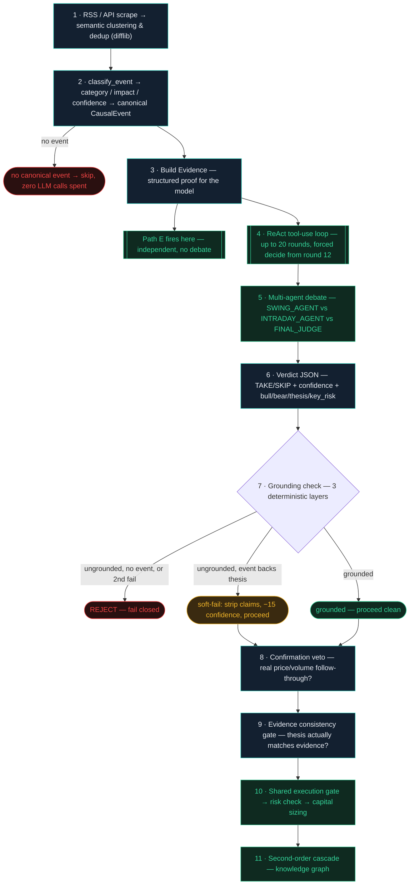

# Trading Pipeline & Strategy Documentation

How AutoTrade Pro discovers, scores, and trades NSE equities and F&O — every stage traced to the running code, with what's actually live marked separately from what exists but isn't switched on.

**Compiled:** 6 August 2026 · **Mode:** Paper trading — ₹20L virtual capital, no real money at risk · **Method:** Direct inspection of running code & live configuration, not design docs

---

## 1. Executive summary

Prajna is an AI-driven trading system for NSE equities and F&O. Every trading day it ingests prices, news, and corporate events; scores roughly 3,000 stocks against four different strategy lenses; and routes the highest-conviction candidates through five semi-independent decision engines. Only three of those five are currently allowed to open a position — the other two run in full, in production, every cycle, but are deliberately prevented from acting on what they find.

That restriction is not a bug or an oversight. On 21 July 2026 the team made a strategic call: **equity trades may only originate from a real, sourced news catalyst** — not from technical pattern-matching alone. The two purely-technical engines (Paths A and B below) were hard-blocked at the single gate every trade passes through, rather than quietly disabled — they keep scoring the market and feeding timing/sizing context to the news-driven engines, they just can no longer open a position on their own.

This document distinguishes three states, used consistently throughout:

- 🟢 **LIVE** — actively executing trades right now
- 🟡 **BLOCKED** — fully built and running, intentionally prevented from executing by the News-Only architecture decision
- ⚪ **OFF** — built, but simply switched off at a feature flag, not part of any strategic decision, could be turned on at any time

F&O trading (options, futures, hedging, volatility strategies) sits outside the equity News-Only decision entirely — it is its own strategy family, and it is currently live. The system as a whole is running in **paper trading mode**: every "BUY" below writes to a simulated ledger, not a real broker order.

---

## 2. What's actually running

The single table to skim if you read nothing else.

### Equity trade origination

| Component | Status | Why |
|---|---|---|
| News Strategy (Path C) | 🟢 LIVE | 24/7 event-driven trading — the primary equity engine post-pivot |
| Pre-Event Expectation Gap (Path D) | 🟢 LIVE | Independent strategy family, scheduled-event based — not affected by the News-Only block |
| Direct News (Path E) | 🟢 LIVE | Fires alongside Path C on the same classified event, own strategy family |
| Master Intelligence Cycle (Path A) | 🟡 BLOCKED | Runs in full every 15 min — scores, closes SL/TP — but `StrategyFamily.TECHNICAL` can never reach execution |
| India Trade Loop (Path B) | 🟡 BLOCKED | Same hard-block; still runs for instrumentation and side-by-side comparison |

### F&O & intraday

| Component | Status | Why |
|---|---|---|
| F&O options/futures/hedging/vol strategies | 🟢 LIVE | Separate `StrategyFamily.FNO`, outside the equity block. All 5 flags on: `ENABLE_FNO`, `ENABLE_OPTIONS`, `ENABLE_FUTURES`, `FNO_HEDGE_ENABLED`, `FNO_VOL_ENABLED` |
| Intraday MIS entry (equity + index option) | 🟢 LIVE | `INTRADAY_ENABLED=True` — scheduled 9:30am entry, 3:10pm square-off |
| Market-shock guard | 🟢 LIVE | Tightens/flattens longs on a sudden index drop, every 30s |

### Discovery & scoring infrastructure

| Component | Status | Why |
|---|---|---|
| Hub Universe, Breakout Screener, Momentum Discovery, Master Intelligence Scorer, Options Chain refresh, Narrative/Macro Intel | 🟢 LIVE | Supporting infrastructure — feeds every path above with candidates, timing, and risk context. Doesn't independently trade |
| ML Direction Predictor | 🟢 LIVE | `ENABLE_ML_PREDICTIONS=true` as of 6 Aug, wired into the scorer the same day — previously had zero call sites anywhere in the scoring path, flag or no flag. Found and fixed a separate corruption bug: every existing model had 100% NaN weights (a missing `.fillna()` on one feature since training began — a single bad row silently poisons an entire LSTM run). Fixed at the source; all models retrained clean |

### Built, not switched on

| Component | Status | Why |
|---|---|---|
| SCAN paper trader | ⚪ OFF | A second, independent scanner-driven paper-trading loop is referenced by a config flag (`SCANNER_ENABLED`), but no code anywhere actually reads that flag — it's an orphaned setting, not a dormant feature. Flipping it does nothing today; building the actual loop is a real dev task, not a flag flip |

---

## 3. Pipeline flow

The mechanism that matters most: five engines read the same scored candidates, but only three can cross the execution gate.

### 3.1 Which path gets through

```mermaid
flowchart TD
    M["MasterIntelligenceScore<br/>shared table, rescored every 15 min"]
    M --> A["A · Master Intelligence Cycle<br/>every 15 min"]
    M --> B["B · India Trade Loop<br/>every 60s"]
    M --> C["C · News Strategy<br/>24/7 service"]
    M --> D["D · Pre-Event Gap<br/>every 15 min"]
    M --> E["E · Direct News<br/>on event"]
    A -. StrategyFamily TECHNICAL .-> X1(("&#10005;"))
    B -. StrategyFamily TECHNICAL .-> X2(("&#10005;"))
    C --> G["Risk Check & Capital Sizing<br/>shared across C · D · E"]
    D --> G
    E --> G
    G --> BUY["BUY order"]
    G --> SKIP["SKIP"]
    BUY --> T["Telegram alert"]

    classDef blocked fill:#3a2a10,stroke:#f0b429,color:#f0b429
    classDef live fill:#0f2a20,stroke:#34d399,color:#34d399
    classDef neutral fill:#132030,stroke:#2dd4bf,color:#e8ecf4
    classDef reject fill:#2a1010,stroke:#ef4444,color:#ef4444
    class A,B blocked
    class C,D,E,BUY,T live
    class M,G neutral
    class X1,X2 reject
```

Every scored candidate is available to all five paths. Paths A and B (pure technical) are stopped at `authorize_trade_intent()` — the single gate every trade-creation call site funnels through — because their `StrategyFamily` is `TECHNICAL`. Paths C, D and E carry a different `StrategyFamily` (`EVENT_DRIVEN`, `PRE_EVENT`, `DIRECT_NEWS`) and pass through to the shared risk/sizing check.

### 3.2 Inside Path C: one headline, eleven steps to a verdict

Path C is the only path that runs an actual LLM debate — Path D scores a nowcast formula and Path E trades directly off classification with no LLM call at all (both below). This is the real step-by-step for Path C, traced from `news_discovery_engine.py` and `engine/agent/decision_engine.py::llm_tooluse_candidate()` — nothing here is simplified.

| Step | What actually happens |
|---|---|
| 1 · Discover | RSS feeds and news APIs are scraped continuously (every 15s). `difflib`-based semantic clustering merges multiple articles covering the same real-world event into one canonical record — three headlines about the same contract win become one event, not three candidates. |
| 2 · Classify | `classify_event()` extracts category, impact tier, and confidence via a structured LLM call, and persists a canonical `CausalEvent` row. Retries on a circuit-breaker window and on malformed JSON so one bad LLM response can't silently drop a real catalyst. No canonical event → the candidate is skipped here, before a single reasoning token is spent. |
| 3 · Build evidence | `_build_evidence()` turns the event into structured `DecisionEvidence` the model will be shown. **Direct News (Path E)** fires right here, off the same evidence, completely independently — it never waits for and is never blocked by anything from step 4 onward. |
| 4 · Investigate | The ReAct tool-use loop: THINK (what do I still need?) → ACT (call one of 9 tools) → OBSERVE (read the result) → repeat, up to 20 rounds. Because a canonical event already exists, `news`/`expert_research` are structurally removed from the tool menu — not discouraged by wording, actually absent — so the model can't go find a second, contradictory "truth" to reason from. 7 tools are mandatory by name (fundamentals, company_intelligence, sector, price_action, market_depth, intraday_candles, options); a repeated call is served from cache. From round 12 onward the model is told no more tools are available and must decide with what it has. |
| 5 · Debate | Before the verdict JSON, the model writes a plain-text debate: **SWING_AGENT** argues the multi-day case, **INTRADAY_AGENT** argues the same-day case, **FINAL_JUDGE** weighs both and states the call — each citing the actual tool outputs gathered in step 4, not general knowledge. |
| 6 · Verdict | A single JSON object: `TAKE`/`SKIP`, confidence (0–100), bull case, bear case, key risk, and a thesis that must not contradict the canonical event's own category/materiality/direction. |
| 7 · Ground | Does bull/bear/thesis cite a fact no tool this session actually returned? Three deterministic checks, not a second LLM asked to grade the first: a capability check (claiming options-flow evidence with no options tool ever called), an event-vocabulary check (naming "partnership"/"regulatory approval"/etc. that appears nowhere in the gathered evidence), and a numeric check (citing a figure that doesn't match what a tool actually returned). One retry is allowed. A second failure with no canonical event backing it is a hard reject. A second failure *with* a canonical event strips the specific unsupported claims, takes a confidence haircut, and proceeds — the event itself is never in question, only the model's embellishments around it. |
| 8 · Confirm | A deterministic backstop behind the model's own TAKE: is there genuine price/volume follow-through right now, or just an unconfirmed headline? An unconfirmed TAKE is downgraded to SKIP here — not left to the model's judgment a second time. No-op on a SKIP verdict. |
| 9 · Consistency | A separate check from grounding: does the calculated confidence actually match the thesis it's attached to? This is what would have caught a real 2026-07-20 incident — a genuinely-calculated 71% confidence attached to a "strong earnings beat" thesis the underlying evidence (materiality: LOW) didn't support. |
| 10 · Execute | Only now does the candidate reach `authorize_trade_intent()` — the same shared gate every path funnels through (§8) — for the market-hours check, risk validation, and capital sizing. |
| 11 · Cascade | A successful BUY can trigger second-order trades via the sector knowledge graph — related tickers exposed to the same event, sized by `event_strength × relationship_strength × company_exposure × market_confirmation`, each of which still passes through its own steps 7–10 independently. |

> **Paths D and E skip almost all of this.** Path D (Pre-Event Expectation Gap) never runs an LLM debate at all — it's a deterministic nowcast formula (sector adapter + point-in-time financials → expectation gap → score), the same 0–100 mechanism as the Master Intelligence Scorer, just for a different trigger. Path E (Direct News) has no LLM call, no tool loop, no debate, and no grounding check — it trades directly off `classify_event()`'s own materiality/confidence output from step 2, which is exactly what makes it fast enough to fire in parallel with Path C on the same event, and exactly why it's sized at a fixed, conservative 0.5% risk rather than the confidence-scaled 2–5% Path C gets.

---

## 4. Discovery & ingestion

Seven always-on jobs keep the candidate pool and market context current. All run on Celery Beat's real production schedule except Event Discovery, which is a dedicated 24/7 service.

| Task | What it does | Cadence |
|---|---|---|
| Price Scan | OHLCV candles + NIFTY/SENSEX/BANKNIFTY/VIX snapshots, Zerodha Kite + yfinance backstop | every 5 min |
| Breakout Screener | Scans all NSE symbols: price ≥4% + volume ≥2× + RSI <85 + close >EMA20. Only while NSE is open | every 5 min +60s |
| Momentum Discovery | Catches slow 30-day grinders the breakout scan misses (10–100% over 30 days). Not market-hours gated | every 30 min |
| Narrative / Macro Intel | FII/DII flow, VIX, sector rotation, market-wide news score | every 5 min |
| Event Discovery & Clustering | Scrapes RSS/APIs, semantic clustering to prevent duplicate events, extracts category + entities via LLM | every 15s |
| Options Chain Refresh | NIFTY, BANKNIFTY & FINNIFTY chains — Greeks, PCR, max-pain, IV-rank | every 15 min |
| ML Direction Predictor | Per-symbol 18-feature LSTM, 3-class UP/DOWN/FLAT, ±15 nudge on the technical score | weekly train |

Breakout and momentum hits are injected directly into the Hub Universe and a live watchlist, and fire a Telegram alert immediately — they don't wait for the next scoring cycle to be visible.

---

## 5. Hub Universe

The pool of stocks eligible for scoring — rebuilt once a day, topped up live throughout the session.

| Turnover floor | Universe cap | Rebuild | Live inject |
|---|---|---|---|
| ≥ ₹1 Cr/day | ~3,000 | 09:00 IST daily | breakout + momentum |

Ranked by `AVG(volume × close)` over the trailing 30 sessions (falls back to 1-hour candle aggregation when daily candles are thin — a cold-start safety net). The floor has been lowered twice — ₹20 Cr → ₹5 Cr → ₹1 Cr/day — specifically so small-caps that move on real volume (JTEKTINDIA ~₹4 Cr, SAKSOFT ~₹4.5 Cr, SIGNPOST ~₹3 Cr) are never invisible to the scorer just because their historical turnover was too small to rank.

---

## 6. Master Intelligence Scorer

Every eligible stock is scored four different ways every 15 minutes, and the engine picks which lens actually decides the trade.

| Strategy | Trigger | Weights |
|---|---|---|
| Event Swing | News≥85 & Tech≥60 | News/catalyst 40% · Technical 30% · Sector 10% · Macro 10% · Volume 10% |
| Technical Swing | Tech≥85 & Vol≥70 | Technical 45% · News 20% · Volume 15% · Sector 10% · Macro 10% |
| Intraday Momentum | default, non-swing | Technical 50% · Volume 25% · Options (PCR/IV) 15% · News 5% · Macro 5% |
| Positional | Fundamentals≥80 | Fundamentals 40% · Earnings 20% · Technical 20% · Macro 10% · Sector 10% |

**Which lens wins:** checked in order — the first match decides: **Event Swing** if News≥85 and Technical≥60. Else **Technical Swing** if Technical≥85 and Volume≥70. Else **Positional** if Fundamentals≥80. Otherwise it falls back to whichever swing score is higher, or Intraday Momentum outside swing mode. A flat **−20 penalty** applies across every swing strategy whenever the Nifty macro regime reads BEAR.

**Score bands:**

| STRONG_BUY | BUY | NEUTRAL | SELL / STRONG_SELL |
|---|---|---|---|
| ≥ 60 (≥40 swing) | ≥ 25 | −25 to 25 | ≤ −25 / ≤ −60 |

---

## 7. The five decision paths

Every path reads the same `MasterIntelligenceScore` table. What differs is whether the trade it wants to open can get past the gate.

**A · Master Intelligence Cycle** — 🟡 BLOCKED — every 15 min, inline with scoring
Same cycle that scores the universe also closes SL/TP hits and evaluates its own top ~10 candidates — but `StrategyFamily.TECHNICAL` is hard-blocked at the gate and can never reach execution. Its scoring output still feeds context to Paths C/D/E; the block is on independent origination, not the scoring itself.

**B · India Trade Loop** — 🟡 BLOCKED — every 60s, 09:15–16:00 IST
Queries the same score table independently, on a faster cadence. Also `StrategyFamily.TECHNICAL` — same hard-block. Still runs full signal validation, position sizing and LLM reasoning for instrumentation and side-by-side comparison; its trade intent simply never clears the gate.

**C · News Strategy (Event-Driven)** — 🟢 LIVE — 24/7 service
Clusters and dedupes articles into one canonical event, classifies category/impact/confidence, then runs a ReAct tool-use debate (§3.2) before a verdict. A grounding check catches hallucinated claims. Enforces **"no event → no trade"** at the gate.

**D · Pre-Event Expectation Gap** — 🟢 LIVE — every 15 min, 24/7 scan · entries before 15:20 IST
Independent of the news pipeline. Scans scheduled corporate events (earnings, board meetings) 1–15 days out and nowcasts the likely surprise from sector-specific adapters plus point-in-time financials. Own 3-flag gate; trades tagged `source="AI Predict"`.

**E · Direct News** — 🟢 LIVE — fires alongside Path C, same event
Trades directly off the classified event's materiality and confidence — no LLM debate, no grounding gate. Requires HIGH/MEDIUM materiality and confidence ≥65%. Sized conservatively at 0.5% risk (vs. the normal 1–2% band) since it skips Path C's confirmation step. A duplicate-position guard stops both paths opening the same trade twice.

> **Market-hours gate:** every equity trade intent, from every strategy family, now requires the market to be genuinely open (09:15–15:30 IST) at the single shared gate — added after a live incident where a wider window meant for position management let a trade open 21 minutes after the real close. Position exits and stop-losses are unaffected by this gate; they close directly and never pass through it, so open risk is always managed regardless of the hour.

---

## 8. Execution gate, risk & sizing

Paths C, D and E all route through one shared checkpoint before anything is bought.

**Capital sizing:** position weight scales from **2% to 5% of equity** with conviction, then is damped by India VIX — full size at VIX 22, tapering to half size by VIX 30. Direct News sizes far more conservatively, fixed at 0.5% risk regardless of conviction.

**Hard caps:**
- **5% of equity** maximum per position
- **20% minimum cash buffer** — no more than 80% of equity is ever deployed at once
- **1.5% minimum stop distance** from entry, regardless of timeframe — stops a mis-scaled ATR (e.g. computed off 1-minute candles) from ever producing a stop so tight it's guaranteed to whipsaw

**Reasoning & audit trail:** all LLM reasoning runs on a single provider — `nvidia.nemotron-super-3-120b` via AWS Bedrock Converse, behind a Redis-backed rate limiter shared across every process. No fallback chain. Every reasoning call, taken or skipped, is persisted with its full reasoning and grounding evidence — nothing trades on an LLM call that isn't logged.

Wallet balance is database-configurable, not hardcoded — ₹20L is the current default.

---

## 9. F&O pipeline

A separate, currently-live strategy family — outside the equity News-Only decision entirely.

Options, futures, hedging and volatility strategies run under their own `StrategyFamily.FNO`, so the equity hard-block on Paths A/B does not apply to them. All five governing flags are on in the live configuration: option buying, futures execution, and both the hedging and volatility overlays. The pipeline includes a Greeks engine, NFO instrument sync, a symbol-aware options factor feeding the Intraday Momentum lens above, its own margin model, and a scheduled expiry sweep (3:45pm IST, weekdays) that settles anything expiring that day.

---

## 10. Alerting

Every trade action is announced the same day it happens — nothing trades silently.

Telegram fires on every executed buy/sell from Paths C, D and E; every breakout or momentum discovery injection; and every F&O position open/close — symbol, price, quantity, score, and the LLM's reasoning summary attached. Paper-mode test runs never leak into the live channel.

---

*Compiled 6 August 2026 by direct inspection of the running system — celery beat schedule, live feature-flag values, and the scoring engine's own weight tables — cross-checked against the in-app `/pipeline` view, not taken from a design document. Figures reflect the configuration at time of writing and will drift as flags change.*
