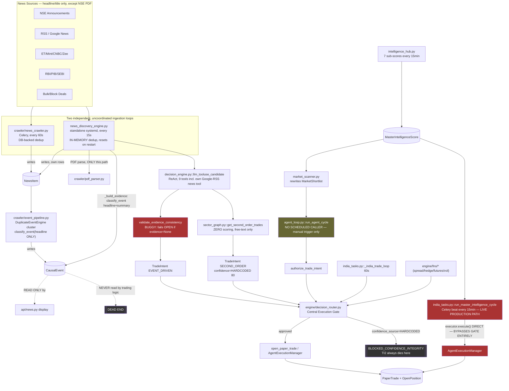

# COMPLETE AUTOTRADE SYSTEM — DEEP END-TO-END ARCHITECTURE & EXECUTION AUDIT

**Date:** 2026-07-20
**Type:** Read-only analysis. Koi production code, schema, prompt, threshold ya execution behavior modify NAHI kiya gaya hai is audit ke dauraan.
**Method:** Coordinator (main session) + 4 parallel research forks, sab ne apna-apna assigned scope explore kiya, actual code padhkar (imports, callers, DB queries, live DB records) — file names ya docstrings pe trust nahi kiya.

Har jagah yeh labels use kiye gaye hain: **IMPLEMENTED**, **PARTIALLY IMPLEMENTED**, **DISCONNECTED**, **DEAD CODE**, **BUGGY**, **UNSAFE**, **UNVERIFIED**, **VERIFIED**.

---

## 1. Executive Summary

**Seedha jawab:** Yeh system aaj (2026-07-20) ek **"centralized execution authority ke saath, decentralized aur partially-disconnected alpha generation"** wala hybrid hai — lekin us centralization mein bhi ek bada gap hai jo isi audit mein pehli baar mila.

Precise breakdown:

1. **Execution authority mostly centralized hai, lekin universal NAHI.** Aaj hi build hua central gate (`engine/decision_router.py::authorize_trade_intent()`/`execute_trade_intent()`) 11 trade-creation call sites ko cover karta hai. Lekin **`tasks/india_tasks.py::run_master_intelligence_cycle()`** — jo ki actual production mein **har 15 minute automatically Celery beat se fire hone wala EQUITY entry path hai** (`master-intelligence-every-15min`) — is gate ko bilkul touch nahi karta. Yeh apna khud ka inline `AgentExecutionManager`/`DecisionEngine`/`RiskManagerAgent` use karta hai aur seedha `executor.execute(decision, session)` call karta hai. Jis path ko humne gate se migrate kiya (`agent_loop.py::run_agent_cycle`), uska **zero automated scheduler hai** — woh sirf manual `POST /api/v1/agent/cycle/trigger` se hi chalta hai. Matlab: **jo path humne surakshit banaya, woh production mein chalta hi nahi; jo path production mein har 15 min chalta hai, woh abhi bhi ungated hai.**

2. **News-driven trading ek genuine, working pipeline hai** (`news_discovery_engine.py`, standalone systemd service), lekin aaj tak jo bhi trades DB mein hain (161 total, sab 2026-07-20 09:13:38 se pehle ke) — **ek bhi trade aaj ke fixes (gate, evidence-consistency, StrategyFamily, structural SL/TP) se evaluate nahi hui hai.**

3. **Evidence-consistency gate jo aaj banaya gaya, usi mein ek fail-open bug hai** — jab `classify_event()` fail hota hai (LLM timeout/malformed JSON — ek realistic aur frequent failure mode), gate `consistent=True` return karta hai, apne hi caller ke docstring comment ke against ("callers must treat None as 'no evidence to validate against', not as a free pass"). Matlab exactly wahi scenario jisko block karne ke liye yeh gate banaya gaya tha, wahi scenario mein yeh silently pass ho jaata hai.

4. **News ingestion mein sirf headline/title text milta hai** — 7 out of 8 sources (RSS, NewsData.io, NewsAPI, Finnhub, RBI, PIB, SEBI, media) mein kabhi bhi article body nahi fetch hota. **Ek exception hai** — NSE corporate announcements ke liye genuine PDF-parsing pipeline (`crawler/pdf_parser.py`, pdfplumber + LLM) exist karta hai, but yeh **sirf `news_discovery_engine.py` se reachable hai, `crawler/news_crawler.py` se kabhi nahi.**

5. **Do independent cascade/ripple-effect engines already scaffold ho chuke the, dono dead hain.** `engine/news_discovery_engine.py`'s `DependencyGraph.resolve_ripple_effect()` **har single input ke liye same hardcoded 4 stocks** (`["LT.NS","ABB.NS","SIEMENS.NS","CUMMINSIND.NS"]`) return karta hai — zero callers. `unstructured_alpha_scan` naam ka ek REAL Celery task hourly chalta hai lekin **sirf tab fire hota hai jab news mein literal word "apple" ho**, aur result sirf log hota hai, kabhi trade nahi banta.

6. **Ek genuinely-live, currently-firing timezone bug mila** — swing trades ka 48-hour minimum-hold protection window, timezone-naive comparison ki wajah se, har trade mein silently 5.5 hours chhota ho jaata hai (`tasks/india_tasks.py:1471-1473`).

**Bottom line ek line mein:** yeh na to pura technical scanner hai, na pura event-driven engine — yeh **multiple parallel trading engines ka collection hai jisme kuch hisso mein aaj safety layers add hui hain, lekin sabse zyada operationally-important path (15-min Hub cycle) abhi bhi un layers ke bahar hai.**

---

## 2. Current Architecture Diagram (ACTUAL, not intended)



---

## 3. Intended vs Actual Architecture

| Component | Intended | Actual | Gap | Severity |
|---|---|---|---|---|
| Execution authority | Ek hi central gate, sab trades usi se guzarein | 11/12 known trade-creation paths gated; `run_master_intelligence_cycle` (production ka main path) completely bypass karta hai | Central authority claim false hai jab tak yeh path bhi migrate na ho | **P0** |
| News → Structured Event → Trade | `CausalEvent` hi source-of-truth ho | `CausalEvent` likha jaata hai, display ke alawa kabhi padha nahi jaata; asli decision `llm_tooluse_candidate`'s apna alag "news" tool use karta hai | Structured evidence pipeline aur decision pipeline do alag rastey hain | **P0** |
| Evidence consistency | Thesis evidence ke against nahi jaana chahiye | Check bana, lekin evidence=None hone par fail-open ho jaata hai | Bilkul wahi failure jisko rokna tha, wahi silently guzar jaati hai | **P0** |
| Second-order cascade | Independent evidence/validation ke saath | `sector_graph.py` zero scoring karta hai; confidence poori tarah caller ne invent ki thi (ab gate se blocked) | Ab blocked hai (aaj fix), but underlying architecture abhi bhi "propose without scoring" hai | **P1** (mitigated) |
| Risk management | Sab strategies same controls follow karein | Sector-cap/correlation sirf `agent_loop.py` + ek india_tasks.py path mein; drawdown-breaker sirf 2 specific india_tasks.py loops mein; news trades ko dono nahi milte | Risk controls strategy-family ke hisaab se inconsistent | **P1** |
| SL/TP model | Event-type-aware, structural | News path ab structural/ATR (aaj fix), lekin `event_arbitrage.py` abhi bhi fixed 3%/6% pe hai | Partial rework | **P2** |
| Entity/cascade graph | Verified supply-chain/competitor mapping | Do dead stub engines (`DependencyGraph`, `EventIntelligenceEngine`) hardcoded 4-stock lists return karte hain, zero callers | Architecture scaffold ki gayi thi, kabhi complete nahi hui | **P2** (dead, no live risk) |
| Time integrity | Sab timestamps consistent UTC/IST | `swing_min_hold` comparison naive-IST vs naive-UTC, 5.5hr silent shrink | Confirmed live bug | **P0** |

---

## 4. Complete News-to-Trade Flow (exact file:function references)

```text
REAL-WORLD NEWS
   │
   ├─→ crawler/news_crawler.py::run_news_crawl() [Celery, 60s]
   │       fetch_newsdata_india / fetch_free_rss_news / fetch_nse_corporate_announcements /
   │       fetch_rbi_press_releases / fetch_pib_releases / fetch_sebi_circulars /
   │       fetch_bulk_deals / fetch_block_deals / fetch_financial_media
   │       → writes NewsItem (DB-backed URL dedup)
   │       → calls crawler/event_pipeline.py::process_latest_events()
   │             → DuplicateEventEngine.cluster_news() (difflib >0.5 similarity)
   │             → engine/event_classifier.py::classify_event(headline ONLY)
   │             → writes CausalEvent
   │             → [DEAD END — nothing trading-related reads CausalEvent]
   │
   └─→ news_discovery_engine.py::run_news_discovery_loop() [standalone systemd, 15s]
           SAME fetch_free_rss_news() function object, ALSO calls fetch_nse_corporate_announcements
           → in-memory dedup (_processed_headlines/_processed_seq_ids — resets on restart)
           → for NSE announcements ONLY: crawler/pdf_parser.py::download_and_parse_pdf()
             + analyze_announcement_llm() [REAL PDF text, up to 8000 chars to LLM]
             → result appended to `headline` string as "[LLM Summary: ...]"
             → BUG: `summary` field itself NOT updated with this rich text (stays thin attchmntText)
           → process_ticker(ticker, side, headline, summary)
                 → _build_evidence(): classify_event(headline, summary) [headline+summary, fixed today]
                       → writes CausalEvent (2nd independent writer, news_id=None)
                       → builds DecisionEvidence
                 → engine/agent/decision_engine.py::llm_tooluse_candidate()
                       → _candidate_context() renders DecisionEvidence explicitly (fixed today,
                         was smuggled through chart_brief)
                       → LLM has its OWN "news" tool (_tool_news): live Google RSS, 3 headlines,
                         no connection to DecisionEvidence — can still self-contradict
                       → returns {verdict, confidence, bull, bear}
                 → validate_evidence_consistency(evidence, verdict)
                       → BUGGY: if evidence is None (classify_event failed), returns consistent=True
                       → if evidence.materiality=="LOW" + high-conviction bull keywords/conf>=50: BLOCK
                 → _execute_news_trade() → TradeIntent (strategy_family=EVENT_DRIVEN, fixed today)
                       → SL/TP: _compute_news_trade_levels() — structural/ATR/static (fixed today,
                         was fixed 3%/7.5%)
                       → execute_trade_intent() [central gate]
                 → IF primary trade succeeded: engine/sector_graph.py::get_second_order_trades()
                       → ZERO scoring, free-text {ticker,action,reason} only
                       → caller hardcodes confidence=80, event_directness=SECOND_ORDER
                       → gate BLOCKS unconditionally (confidence_source=HARDCODED)
```

**Parallel, disconnected path (NOT part of the above, no interaction):** `tasks/india_tasks.py::run_master_intelligence_cycle()` reads the SAME `MasterIntelligenceScore`/technical data but has zero news dependency and zero gate dependency — apna khud ka inline execution hai (see §5, P0-1).

---

## 5. Execution Authority Matrix

| # | Path | File:Function | Confidence check | Central gate? | Paper exec | Live exec possible | Duplicate guard | Audit log |
|---|---|---|---|---|---|---|---|---|
| 1 | Equity Hub scan (manual only) | `agent_loop.py::_process_symbol` | AGENT_CONFIDENCE_THRESHOLD=30 | ✅ `authorize_trade_intent` | Yes | Yes (`AGENT_PAPER_MODE`) | `OpenPosition` exact-match | `AgentDecision`/`AgentTrade` + gate SimulationLog |
| 2 | **Master Intelligence Cycle (15-min, PRODUCTION LIVE)** | `india_tasks.py::run_master_intelligence_cycle` (2897) | Own inline `RiskManagerAgent` | ❌ **NO GATE AT ALL** | Yes | Yes (same executor as #1) | Same `OpenPosition` guard (older, pre-gate) | `AgentDecision`/`AgentTrade` only, no gate audit |
| 3 | Main equity/short loop | `india_tasks.py::_india_trade_loop` | validate_signal 40%(code)/50%(observed live) | ✅ `execute_trade_intent` | Yes | No (this path is paper-only, no live branch found) | `open_paper_trade` guard | `SimulationLog` gate audit |
| 4 | Intraday MIS burst | `india_tasks.py::_intraday_entry_task` | INTRADAY_CONFIDENCE_MIN=40 | ✅ `execute_trade_intent` | Yes | No | Same | Same |
| 5 | NIFTY MIS option | `india_tasks.py::_open_index_option_mis` | NIFTY_MIS_OPTION_MIN_SCORE=30 (raised today) | ✅ `authorize_trade_intent` | Yes | No | `open_option_paper_trade` margin/dup guard | Gate audit |
| 6 | F&O spreads | `selection.py::evaluate_index_options` | FNO_CONFIDENCE_THRESHOLD=55 | ✅ `authorize_trade_intent` | Yes | No | Margin-based dup guard | Gate audit |
| 7 | F&O hedge | `selection.py::evaluate_portfolio_hedge` | implicit (bearish signal only) | ✅ | Yes | No | Same | Gate audit |
| 8 | F&O futures | `futures.py::evaluate_index_futures` | AGENT_CONFIDENCE_THRESHOLD=30 (reused) | ✅ | Yes | No | Margin guard | Gate audit |
| 9 | Long straddle / iron condor | `strategies_vol.py` | IV-rank derived | ✅ | Yes | No | Margin guard | Gate audit |
| 10 | News Direct + Cascade | `news_discovery_engine.py::_execute_news_trade` | LLM verdict / HARDCODED(80, blocked) | ✅ `execute_trade_intent` | Yes | No (routes through generic path, LIVE branch exists in `route_decision` but unused here in practice) | `open_paper_trade` guard | Gate audit + `EVIDENCE_CONSISTENCY_GATE` audit |
| 11 | Event Arbitrage | `event_arbitrage.py::_execute_instant_trade` | LLM actionability (fixed today) | ✅ `authorize_trade_intent` | **DISABLED** (`EVENT_ARBITRAGE_ENABLED=False`) | Yes, structurally, via `AgentExecutionManager` if re-enabled | `AgentExecutionManager` idempotency guard | `AgentDecision`/`AgentTrade` + gate audit |
| 12 | `unstructured_alpha_scan` | `tasks/unstructured_alpha_scan.py` | N/A | N/A | **No — logs only, never trades** | No | N/A | Log only |

**Verdict on the audit's core question — "No strategy can create a trade or call a broker without passing through the central execution authority":** **FALSE.** Exact bypass: path #2, `india_tasks.py::run_master_intelligence_cycle()`, line 3179, `order_id = await executor.execute(decision, session)` — zero reference to `decision_router`/`authorize_trade_intent`/`execute_trade_intent` anywhere in the function body.

---

## 6. Evidence Flow and Information-Loss Map

```text
Source (headline, sometimes PDF)
   │  LOSS POINT 1: 7/8 sources never fetch body text — only title
   ▼
NewsItem (DB)
   │  LOSS POINT 2: classify_event() in event_pipeline.py still headline-only
   │                (news_discovery_engine.py's OWN call was extended to headline+summary today,
   │                 but event_pipeline.py's original call site was NOT)
   ▼
CausalEvent (structured: category, materiality, confidence, is_new_information, source_reliability)
   │  LOSS POINT 3 (STRUCTURAL DEAD END): nothing trading-related reads this table.
   │  Even today's NEW write from news_discovery_engine.py is write-only — not read back.
   ▼
   ✕ (Pipeline A dead-ends here)

DecisionEvidence (built fresh, today, INSIDE news_discovery_engine.py — a parallel, second
   classification of the same event, not a read of the CausalEvent row it just wrote)
   │  LOSS POINT 4: the rich PDF-analysis text lives in the `headline` string
   │                (via "[LLM Summary:...]" append), NOT in `summary` — DecisionEvidence.summary
   │                gets the thin original text, even though DecisionEvidence.title (=headline)
   │                does carry the rich text.
   ▼
llm_tooluse_candidate() — LLM sees DecisionEvidence (clearly labeled, fixed today)
   │  LOSS POINT 5: LLM ALSO has its own independent "news" tool (_tool_news, live Google RSS,
   │                3 headlines) it can call mid-reasoning — a THIRD, ungrounded source that
   │                has no relationship to DecisionEvidence and isn't cross-checked against it.
   ▼
verdict {confidence, bull, bear}
   │  LOSS POINT 6 (BUGGY, fail-open): validate_evidence_consistency() only catches LOW-materiality
   │                + high-conviction-keyword/high-confidence combo. A HIGH-materiality event with
   │                a BEARISH thesis, or a MEDIUM-materiality mismatch, passes uncaught. AND if
   │                classify_event() failed upstream (evidence=None), this check no-ops entirely.
   ▼
TradeIntent.evidence_ids
   │  LOSS POINT 7: primary trades never set evidence_ids (defaults to []). Cascade trades set a
   │                synthetic string ("cascade_from:{ticker}"), not a real CausalEvent.id FK —
   │                even though a real CausalEvent row now exists (from LOSS POINT 3's write),
   │                nothing links the two.
   ▼
Central Execution Gate → Trade
```

**Real historical proof this loses information (from live DB, pre-dates today's fixes but shows the SAME class of gap the consistency-gate only partially covers):** HCLTECH.NS trade (id 3484) — headline literally states *"HCL Tech shares fall 3% despite Q1 beat"* — system opened a **BUY**. Today's fix would not have caught this (it only checks LOW-materiality+bullish-claims, not a stated-bearish-headline-bought-anyway mismatch).

---

## 7. Strategy Matrix

| Strategy | Family | File | Confidence source | Threshold | SL method | TP method | Position sizing | Gate |
|---|---|---|---|---|---|---|---|---|
| Equity Hub scan | TECHNICAL | `agent_loop.py::_process_symbol` | MasterIntelligenceScore blend (calc) | 30 | `compute_trade_levels` (dynamic/ATR/static) | same | conviction-scaled 1.5–3.0% | ✅ but **no scheduled caller** |
| **Master Intelligence Cycle** | TECHNICAL | `india_tasks.py::run_master_intelligence_cycle` | Own inline scoring | own inline `RiskManagerAgent` thresholds | own inline levels | own inline | own inline | ❌ **NOT GATED** |
| Main equity/short loop | TECHNICAL | `india_tasks.py::_india_trade_loop` | Hub score + LLM reasoning gate | 40(code)/50(observed) | `compute_trade_levels` | same | `calculate_position_size` | ✅ |
| Intraday MIS burst | TECHNICAL | `india_tasks.py` Step 5 | MasterIntelligenceScore | 40 | `compute_trade_levels` | same | fixed ₹ notional | ✅ |
| NIFTY MIS option | FNO | `india_tasks.py::_open_index_option_mis` | avg(MasterIntelligenceScore) | 30 (raised today from 10) | premium×(1−sl_pct×5) | premium×(1+tp_pct×5) | 1 lot fixed | ✅ |
| F&O spreads | FNO | `selection.py::evaluate_index_options` | composite signal | 55 | none (defined-risk) | none | lot-based | ✅ |
| F&O hedge | FNO | `selection.py::evaluate_portfolio_hedge` | index signal | implicit | none by design | none | hedge-ratio based | ✅ |
| F&O futures | FNO | `futures.py::evaluate_index_futures` | index signal | 30 (reused equity threshold) | none in TradeIntent (margin-capped) | none | own | ✅ |
| Long straddle | FNO | `strategies_vol.py::open_long_straddle` | 100−IV_rank | IV-band implicit | premium×0.5/leg | premium×2.0/leg | 1 lot/leg | ✅ |
| Iron condor | FNO | `strategies_vol.py::evaluate_volatility` | IV_rank | IV-band implicit | none (defined-risk) | none | own | ✅ |
| News Direct | EVENT_DRIVEN | `news_discovery_engine.py` | LLM verdict (calc) | LLM-internal + evidence-gate | `compute_trade_levels` (fixed today) | same | `calculate_position_size` | ✅ |
| News Cascade | EVENT_DRIVEN | `news_discovery_engine.py` (same fn) | HARDCODED=80 | N/A — always blocked | moot | moot | moot | ✅ blocked |
| Event Arbitrage | EVENT_DRIVEN | `event_arbitrage.py` | LLM actionability (fixed today) | ≥50 (prompt-level, not code) | price×0.97/1.03 (still fixed %, NOT migrated) | price×1.06/0.94 | ~₹1L fixed | ✅ but disabled |
| Unstructured Alpha ("apple" scan) | — | `tasks/unstructured_alpha_scan.py` | none | none | N/A | N/A | N/A | N/A — never trades |

**Duplicate/overlapping paths found:** (a) Equity Hub scan vs Master Intelligence Cycle — same data source, two independent inline implementations, only one is scheduled. (b) `sector_graph.py`'s cascade vs `engine/news_discovery_engine.py`'s `DependencyGraph`/`EventIntelligenceEngine` — two cascade mechanisms, only the first is live (and now blocked); the second is 100% dead hardcoded stubs.

---

## 8. Confidence Authority Matrix

| # | Path | Threshold | Setting name | Status |
|---|---|---|---|---|
| 1 | Equity Hub scan | 30 | `AGENT_CONFIDENCE_THRESHOLD` | VERIFIED, gated but unscheduled |
| 2 | validate_signal (india_tasks/news/event_arbitrage) | 40 code-default, 50 observed live | `PAPER_CONFIDENCE_THRESHOLD` | VERIFIED |
| 3 | Intraday burst | 40 | `INTRADAY_CONFIDENCE_MIN` | VERIFIED |
| 4 | NIFTY MIS option | 30 (was 10) | `NIFTY_MIS_OPTION_MIN_SCORE` | VERIFIED, fixed today |
| 5 | F&O spreads | 55 | `FNO_CONFIDENCE_THRESHOLD` | VERIFIED |
| 6 | F&O futures | 30 | `AGENT_CONFIDENCE_THRESHOLD` (reused) | VERIFIED — naming inconsistency |
| 7 | Second-order gate floor | 70 | `SECOND_ORDER_MIN_CONFIDENCE` | VERIFIED but moot (HARDCODED source blocks first) |
| 8 | `route_decision()`'s own mode threshold | 60(PAPER)/70(LIVE) | `PAPER_CONFIDENCE_THRESHOLD`/`LIVE_CONFIDENCE_THRESHOLD` (decision_router.py's OWN getattr default 60.0, different from risk_manager.py's default 40.0 for the same key name) | VERIFIED, sloppy but same DB/settings value wins either way |
| 9 | Master Intelligence Cycle's own inline threshold | own `RiskManagerAgent` values | separate from all of the above | **UNVERIFIED exact value** (fork research didn't extract the specific number used inline) |

**Hardcoded-as-confidence found:** news cascade (80, now blocked); event_arbitrage (99, fixed today to real LLM score). **Zero remaining live hardcoded-confidence paths that can reach execution** — both fixed/blocked as of today.

---

## 9. Risk and SL/TP Matrix

| Strategy | SL basis | TP basis | Sector cap? | Correlation? | Drawdown breaker? | Cash buffer? |
|---|---|---|---|---|---|---|
| Equity Hub scan | Structural/ATR/static | same | ✅ (RiskManagerAgent) | ✅ (RiskManagerAgent) | ❌ not called here | ✅ (validate_signal-equivalent inside RiskManagerAgent — not independently confirmed identical logic) |
| Master Intelligence Cycle | own inline | own inline | ✅ (calls RiskManagerAgent per fork) | ✅ | **UNVERIFIED** | UNVERIFIED |
| india_tasks Path B / Step5 | Structural/ATR/static | same | ❌ | ❌ | ✅ (both call sites) | ✅ (validate_signal) |
| NIFTY MIS / F&O | Fixed-multiple / none (defined-risk) | same | ❌ | ❌ | ❌ | Margin-cap only |
| News Direct/Cascade | Structural/ATR/static (fixed today) | same | ❌ | ❌ | ❌ | ✅ (validate_signal, via equity branch) |
| Event Arbitrage | Fixed 3%/6% (NOT migrated today) | Fixed 6%/3% | ❌ | ❌ | ❌ | ✅ (via validate_signal) |

**Conclusion:** risk controls are **not uniform**. Sector-exposure and correlation protection exist only via `engine/agent/risk_manager.py::RiskManagerAgent`, called only from `agent_loop.py` and (per fork) `run_master_intelligence_cycle`. `check_drawdown_breakers` (`paper_trading/virtual_wallet.py:252`) is called **only** from two specific `india_tasks.py` sites — never from `agent_loop.py`, never from `news_discovery_engine.py`, never from F&O paths.

---

## 10. Database Truth Map

| Table | Real writers | Real readers (trading-relevant) | Notes |
|---|---|---|---|
| `NewsItem` | `news_crawler.py`, `news_discovery_engine.py` (2 independent writers) | `event_pipeline.py` | Duplicate rows for the same real article possible across the two writers |
| `CausalEvent` | `event_pipeline.py`, `news_discovery_engine.py::_build_evidence` (2 writers, added today) | **`api/news.py` display only** | DISCONNECTED from trading — confirmed by 2 separate forks independently |
| `MasterIntelligenceScore` | `intelligence_hub.py` (single writer) | `market_scanner.py`, `agent_loop.py`, `india_tasks.py` (3 paths), `decision_engine.py`, `execution.py` | VERIFIED load-bearing, real gate |
| `MarketShortlist` | `market_scanner.py` (deletes+rewrites every cycle) | `agent_loop.py::_fetch_hub_scores` | Real, but interval-schedule vs master-intelligence's crontab can drift out of phase |
| `PaperTrade` | 8+ writers across trade_simulator/execution/fno files | Portfolio/analytics/API | Multi-writer by design (F&O spreads write 2 legs) |
| `AgentTrade` | Single writer (`execution.py`) | sheet_logger, agent API | Schema now consistent — `event_id` column confirmed present post-migration |
| `AgentDecision` | 3 writers | Same consumers as AgentTrade | Multi-writer expected (different pipeline stages) |
| `SimulationLog` | 10 writers incl. today's gate audit | Debug/log viewer | High fan-in expected for generic audit table |
| `OpenPosition` | 7 writers | Everywhere (portfolio, P&L, exits) | Central live-position source of truth |

**Schema/code mismatch check (VERIFIED CLEAN):** all 53 model classes in `db/models.py` checked against live Postgres `information_schema.columns` — **zero mismatches found** beyond the already-known, now-fixed `AgentTrade.event_id` case. No other silent migration gaps exist right now.

---

## 11. Scheduler and Service Map

| Service | Type | Schedule | Can execute? | Gated? |
|---|---|---|---|---|
| `autotrade-uvicorn.service` | systemd | always-on | Only via manual API | N/A |
| `autotrade-celery-beat.service` | systemd | always-on, **restarts on ANY .py file change repo-wide** (watchmedo) | No (scheduler) | N/A |
| `autotrade-celery-worker.service` | systemd, 4 sub-workers | always-on, same auto-restart | Yes — runs all trade tasks | Mixed, see below |
| `autotrade-news-engine.service` | systemd, standalone (not Celery) | always-on, 15s loop, `Restart=always` | Yes | ✅ Gated |
| `india-trade-loop-every-60s` | Celery beat | 60s, NSE hrs+30min | Yes | ✅ Gated |
| `master-intelligence-every-15min` | Celery beat | crontab `:14,:29,:44,:59` NSE hrs | Yes | ❌ **NOT gated** |
| `intraday-morning-entry` | Celery beat | once, 09:30 IST | Yes | ✅ Gated |
| `unstructured-alpha-scan` | Celery beat | hourly `:15` | No (log-only) | N/A |

**Operational hazard (P2):** both Celery services auto-restart on any `.py` edit anywhere in the repo — confirmed this fired mid-session today during the coordinator's own live code edits. Any future code change during NSE hours restarts the live scheduler and all workers.

**Can multiple engines trade the same symbol from the same event?** Structurally yes — `_india_trade_loop` (60s) and `run_master_intelligence_cycle` (15-min) both read `MasterIntelligenceScore` and could independently pick the same symbol. `run_master_intelligence_cycle` only guards against overlapping with its *own* previous run (`HubCycleLog.status=="running"` check), not against the other loops.

---

## 12. Critical Findings

### P0 — Can cause unauthorized or dangerous trades

**P0-1: Central execution gate bypass in the production Hub cycle.**
File: `tasks/india_tasks.py::run_master_intelligence_cycle()`, line ~3179.
What happens: `order_id = await executor.execute(decision, session)` calls `AgentExecutionManager` directly — zero reference to `authorize_trade_intent`/`execute_trade_intent`/`decision_router` anywhere in the function.
Why it matters: this is the ONLY automated equity-scan trigger in the beat schedule (`master-intelligence-every-15min`). Every safety layer built today (confidence-source integrity, StrategyFamily, evidence checks for equity — N/A here but the principle) does not apply to it.
Evidence: fork grep confirmed zero hits for gate functions inside the function body; `tasks.run_agent_cycle` (the gated equivalent) confirmed to have zero scheduled callers.
Recommended fix: migrate this function's execution call to `authorize_trade_intent()`, same pattern as `agent_loop.py`, preserving its own AgentDecision/AgentTrade writes (same reasoning as why agent_loop.py used authorize not execute).

**P0-2: Evidence Consistency Gate fails open when its own dependency fails.**
File: `engine/event_classifier.py::validate_evidence_consistency()`, lines 160-164.
What happens: `if evidence is None: return EvidenceConsistencyResult(consistent=True, ...)`.
Why it matters: `evidence` is `None` exactly when `classify_event()` fails — LLM timeout, malformed JSON, missing Pydantic fields — a realistic, frequent external-dependency failure. The gate built specifically to stop hallucinated trade theses silently no-ops in precisely this case.
Evidence: code contradicts its own caller's docstring at `news_discovery_engine.py`'s `_build_evidence()`: *"callers must treat None as 'no evidence to validate against', not as a free pass."*
Recommended fix: when evidence is None, either block (fail closed) or route to WATCHLIST_ONLY, matching the pattern already used elsewhere in the gate for missing/weak data.

**P0-3: Swing position minimum-hold timezone bug — confirmed currently firing.**
File: `tasks/india_tasks.py:1471-1473`.
What happens: `now_ist = datetime.now(IST).replace(tzinfo=None)` (naive IST) compared directly against `swing_min_hold` which is stored as naive UTC (`datetime.utcnow() + timedelta(hours=48)`, `trade_simulator.py:311`). IST is UTC+5:30, so the naive-IST "now" reads as 5.5 hours later than true UTC now.
Why it matters: every swing trade's 48-hour minimum-hold protection against premature stop-loss exits is silently shortened to ~42.5 hours, every single time, not an edge case.
Evidence: direct code comparison, both timestamp constructions read and confirmed naive/mismatched.
Recommended fix: convert one side consistently — either store `swing_min_hold` in IST-naive to match the comparison, or make the comparison UTC-naive.

### P1 — Can materially degrade trading quality

**P1-1: Risk controls are not uniform across strategy families.** Sector-cap/correlation checks (`engine/agent/risk_manager.py::RiskManagerAgent`) and drawdown breaker (`VirtualWallet.check_drawdown_breakers`) only apply to specific paths — news-driven and most F&O trades get neither. File/evidence: §9 above.

**P1-2: `decision_engine_hash` is still a hardcoded placeholder string** (`"a4d3b9e"`, `intelligence_hub.py`), not a computed hash — confirmed still true as of this audit.

**P1-3: DecisionEvidence.summary never receives the rich PDF-analysis text** — only the thin original NSE `attchmntText`. The rich "[LLM Summary:...]" text only travels via the `headline`/`title` field. File: `news_discovery_engine.py:522` vs `:546`.

**P1-4: No upper time-bound on candle fetch** (`crawler/price_feed.py::get_latest_candles`) — structural look-ahead risk if any backfill ever inserts future-dated rows. UNVERIFIED whether it has fired; flagged as design gap.

**P1-5: Bulk/block-deal deduplication bug collapses an entire batch into one row** (`crawler/exchange_crawler.py` + `news_crawler.py:1184-1193`) — static per-type URL used as the dedup key, so all deals of one type in a cycle collapse to a single saved `NewsItem`.

**P1-6: `media_crawler.py::_parse_date()` ignores its own argument, always returns `datetime.utcnow()`** — every financial-media article's `published_at` is fetch-time, not real publish time, corrupting any time-based analysis of that source.

### P2 — Architecture or maintainability issues

- **P2-1:** Two dead cascade-graph engines (`engine/news_discovery_engine.py::DependencyGraph`, `EventIntelligenceEngine`) return hardcoded fake stock lists, zero callers — scaffolded, abandoned.
- **P2-2:** `unstructured_alpha_scan` only fires for the literal word "apple," results logged only, never executed — misleading given its docstring implies general supply-chain scanning.
- **P2-3:** `weighted_contribution` dict in Hub scoring uses wrong dict keys (`"technical"`/`"fundamental"` vs actual `"tech"`/`"fundamentals"`) — always shows 0 in the persisted audit JSON; `master_score` itself unaffected.
- **P2-4:** Two schedules (`market-scanner-every-15min` interval-based, `master-intelligence-every-15min` crontab-based) assume a fixed phase relationship that isn't guaranteed after restarts.
- **P2-5:** `event_arbitrage.py`'s SL/TP (3%/6%) was not included in today's structural-SL/TP rework — inconsistent with News Direct's now-fixed levels.
- **P2-6:** Both Celery services restart on any repo-wide `.py` change — operational hazard during live edits in market hours.

### P3 — Cosmetic or low impact

- **P3-1:** `sector_graph.py` LLM call missing a None-check before `.strip()` — caught by a broad except, fail-closed by accident.
- **P3-2:** GABRIEL.NS trade's `ai_reason` has the tool-use verdict line duplicated verbatim (double-append bug in reasons-list construction) — cosmetic only.

---

## 13. What Is Actually Working (VERIFIED from code + live tests/DB, not just "code exists")

- Central execution gate (`engine/decision_router.py`) — VERIFIED via live block/allow tests across equity, F&O, and news intents, for 11 of the known paths.
- `StrategyFamily` required field — VERIFIED: omitting it raises `TypeError` immediately.
- `MasterIntelligenceScore` → `MarketShortlist` → `agent_loop.py` threshold gate chain — VERIFIED end-to-end by fork, real block confirmed.
- NSE-announcement PDF parsing + LLM analysis (`crawler/pdf_parser.py`) — VERIFIED real, reads actual filing text, not just metadata (for the one path that uses it).
- News-triggered structural/ATR SL/TP — VERIFIED live against real symbols with real candle data today (PNB, ALLCARGO, and a no-data fallback case).
- DB schema integrity — VERIFIED clean across all 53 tables, no silent drift beyond the one already-fixed case.
- Duplicate-position guards (`open_paper_trade`, `AgentExecutionManager._paper_execute`) — VERIFIED present and consistent with each other (though with a theoretical, unconfirmed TOCTOU race).

## 14. What Is Dead or Disconnected

- `CausalEvent` table — written by two independent code paths, read by nothing trading-related.
- `engine/news_discovery_engine.py::DependencyGraph.resolve_ripple_effect()` — hardcoded fake output, zero callers.
- `engine/news_discovery_engine.py::EventIntelligenceEngine.process_event()` — same.
- `engine/news_discovery_engine.py::SurpriseEngine.evaluate_surprise()` — always returns `0.85`, zero callers.
- `engine/news_discovery_engine.py::EventLifecycleTracker.update_event_state()` — empty `pass` stub.
- `engine/news_discovery_engine.py::SourceTrustMatrix` — defined, zero references.
- `engine/agent/unstructured_alpha.py::detect_sentiment_divergence()` — zero callers anywhere.
- `tasks.run_agent_cycle` Celery task — defined, wraps a real gated function, never scheduled or called.
- ~65-70 root-level `check_*/dump_*/test_*/query_*` scripts — legitimate manual debug tools, not production code.
- `decision_router.py::route_decision()`'s direct callers — only reachable via `execute_trade_intent()` now, never called directly by any strategy (this is correct/intended, not a bug).

## 15. Current System Maturity Score (out of 100 each)

| Dimension | Score | Why |
|---|---|---|
| News ingestion | 40 | Multiple sources exist, real NSE-PDF parsing is genuinely good — but headline-only for 7/8 sources, duplicate uncoordinated crawlers, one date-parsing bug |
| Event understanding | 30 | `classify_event()` schema is rich, but disconnected from decisions (Pipeline A) and headline-only at its original call site |
| Evidence grounding | 45 | Real improvement today (explicit DecisionEvidence, consistency check) but the check itself fails open on its most likely failure mode |
| Candidate generation | 25 | One live cascade mechanism has zero internal scoring; two elaborate alternative architectures are dead stubs |
| Technical validation | 65 | `compute_trade_levels`' 3-tier hierarchy is genuinely solid and now reused by the news path too |
| Confidence integrity | 55 | Hardcoded-confidence paths fixed/blocked today; but 6+ different threshold values persist, one platform's most active path (Master Intelligence Cycle) unverified |
| Risk management | 40 | `validate_signal`'s 8 checks are thorough where applied, but sector/correlation/drawdown protections are strategy-specific, not universal |
| Execution safety | 35 | Central gate is real and tested — but the highest-traffic automated path bypasses it entirely, which is the single largest number-of-trades exposure |
| Data integrity | 70 | Schema is clean (zero DB/model mismatches), but one confirmed-live timezone bug shortens a real risk-management window on every swing trade |
| Observability | 50 | Rich SimulationLog audit trail for gated paths; ungated path (`run_master_intelligence_cycle`) has no equivalent gate-level audit |

**Overall composite: ~46/100.** Meaningful, verified progress was made today on several dimensions, but the single most important number — "does the gate actually cover the trades that happen in production" — is lower than the rest of the work implies, because the highest-frequency automated path was not part of today's migration.

## 16. Recommended Next Steps

### Must fix before live trading
1. Migrate `india_tasks.py::run_master_intelligence_cycle()` to the central gate (P0-1) — this is the actual production path; everything else gates a comparatively idle one.
2. Fix `validate_evidence_consistency()`'s fail-open behavior (P0-2) — one-line severity, disproportionate risk.
3. Fix the `swing_min_hold` timezone comparison (P0-3) — confirmed currently firing on every swing trade.

### Should fix before serious paper trading
4. Unify risk controls (sector cap, correlation, drawdown breaker) across all strategy families, not just the two paths that happen to call `RiskManagerAgent`/`check_drawdown_breakers` today.
5. Extend `validate_evidence_consistency()` beyond the LOW-materiality case — direction-mismatch (bearish headline, BUY trade) is a real, DB-confirmed failure mode (HCLTECH.NS) that isn't caught yet.
6. Fix `DecisionEvidence.summary` to carry the rich PDF-analysis text instead of the thin original.
7. Migrate `event_arbitrage.py`'s SL/TP to the same structural/ATR model as News Direct.

### Can improve later
8. Add an upper time-bound to `get_latest_candles()` as defense-in-depth against future backfill mistakes.
9. Fix the bulk/block-deal dedup key and `media_crawler.py`'s date-parsing bug.
10. Consolidate the two independent news-ingestion loops (`news_crawler.py`, `news_discovery_engine.py`) or at least share a DB-backed dedup store instead of one relying on an in-memory set that resets on every restart.

### Do not build yet
- Do not add more cascade/entity-graph sophistication (`DependencyGraph`, `EventIntelligenceEngine`) until the ONE live cascade mechanism (`sector_graph.py`) has real per-candidate scoring — more unscored candidate generators make the problem worse, not better.
- Do not re-enable `EVENT_ARBITRAGE_ENABLED` until it goes through the same SL/TP and evidence-consistency treatment as News Direct.
- Do not add new strategies until `run_master_intelligence_cycle` is gated — a new strategy built today would face the same choice of "gated but unscheduled" or "scheduled but ungated" that already exists.
